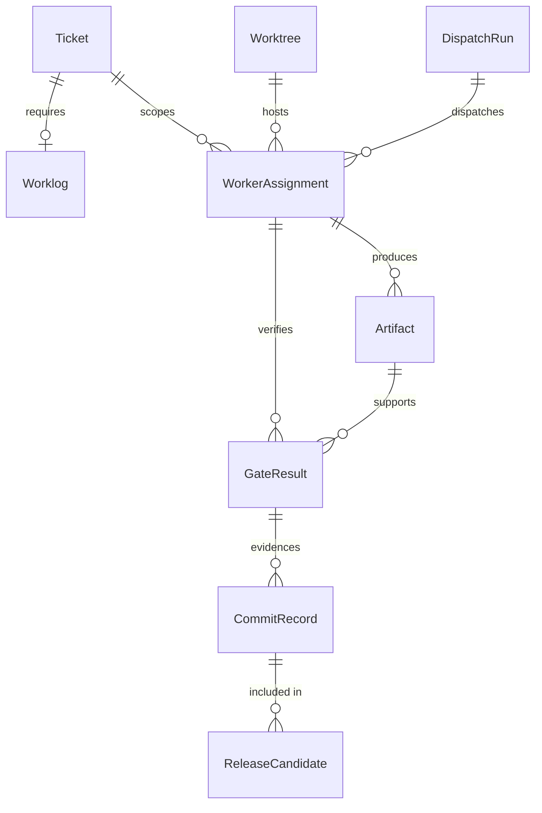

# Agent Workbench Suite Swarm Specification

## 1. Reformulated Mission

Bring the ROX ONE / Agent Workbench Suite fork into an executable, audited project state: reconcile the ticket/worklog/worktree truth, preserve private GitHub commit flow, restore a swarm control layer, and execute the remaining product roadmap through bounded parallel workers with QA gates.

The product target remains:

Raw idea -> prompt rewriting -> thinking partner -> spec builder -> multi-agent execution -> review and verification -> Experience Layer missions, quests, agent registry, progression, and release-grade deliverables.

## 2. Assumptions and Boundaries

- Russian-first user-facing UX remains the default.
- `origin` is the private GitHub remote for project commits.
- `rox-origin` is upstream/reference only.
- Feature code must not start until the relevant ticket, worklog, worker assignment, and validation gate are explicit.
- Long-running missions, game/arena presentation, and paid capacity must share one truth layer and cannot bypass validation evidence.
- Tests must use deterministic fake providers for LLM, scheduler, storage, billing, package registry, browser, and email surfaces.
- This specification is a control-layer artifact, not a product-code implementation.

## 3. Supervisor Truth Model

| Entity | Key | Purpose | Required evidence |
|---|---|---|---|
| `Ticket` | `id`, `slug`, `status` | Backlog item and scope boundary | `docs/tickets/T###-slug.md` |
| `Worklog` | `ticketId`, `path` | TDD/evidence journal | Required 11-section worklog |
| `Worktree` | `path`, `branch`, `head` | Isolated implementation sandbox | `git worktree list --porcelain`, dirty/ahead/behind check |
| `DispatchRun` | `phase`, `owner`, `status` | Supervisor execution state | `.swarm/plan.md`, phase gate record |
| `WorkerAssignment` | `lane`, `ticketIds`, `writeScope` | Bounded worker contract | prompt packet, files owned, forbidden scopes |
| `Artifact` | `path`, `type`, `owner` | Generated plan/test/evidence output | file path and producing command |
| `GateResult` | `gateId`, `command`, `result` | QA proof | command output summary, pass/fail |
| `CommitRecord` | `hash`, `ticketIds`, `tested` | Git evidence | Lore commit message and validation notes |
| `ReleaseCandidate` | `version`, `gates`, `knownRisks` | Final readiness bundle | green gate matrix and known limits |

## 4. ERD

## 5. Data Flow

## 6. Component and Screen Map

| Area | Screens / modules | Current target |
|---|---|---|
| Core shell | Sessions, composer, sources, skills, agents | Preserve existing Rox behavior while adding ROX workflows |
| Prompt-to-spec | Prompt Lab, Spec Builder, Round Table, Review Gate | Make rough prompts executable and verified |
| Account/cloud | Account, teams, billing, storage, share links | Personal cabinet first, auth/share flows must be real and tested |
| Experience Layer | Deep Missions, Arena Builder, Mission Control, Progression, Quest Map, Agent Forge | Command/Game/Arena presentation over one evidence-backed truth model |
| File/knowledge | File Manager, PDF, Markdown graph, Office adapter, browser research | Later execution wave, fake-provider tested |
| Release | TDD, GitHub worktrees, CI, Mac ARM, E2E, security, audit | Release-candidate gate before user-facing completion |

## 7. Dispatch Contract

Supervisor packet:

- phase
- ticket ids
- objective
- repo context
- exact write scope
- forbidden files and providers
- tests to write first
- expected red result
- validation commands
- worklog path
- commit requirement

Worker response:

- files inspected
- tests added before implementation
- red output summary
- implementation summary
- validation output summary
- changed files
- risks/blockers
- acceptance matrix

Worker constraints:

- never edit outside write scope without supervisor handoff
- never weaken assertions to pass tests
- never call real external providers in tests
- never stage unrelated files
- never mark elapsed time as mission success
- paid entitlements can increase capacity only, not quality

## 8. QA Gates

| Gate | Required for | Commands / proof |
|---|---|---|
| `G0-discover` | Any phase transition | inventory for repo, tickets, worklogs, worktrees |
| `G1-plan` | Before EXECUTE | `.swarm/spec.md`, `.swarm/plan.md`, critic review |
| `G2-tdd` | Each ticket | expected red test before feature code |
| `G3-targeted` | Each ticket | targeted unit/integration/UI/E2E/security tests |
| `G4-broad` | Shared/runtime changes | typecheck, lint, build, relevant validators |
| `G5-privacy` | Push/remote work | private origin verified |
| `G6-release` | Final | E2E, smoke, security, audit, release notes |

## 9. Concrete First Dispatch

The first executable worker packet is:

- `.swarm/dispatch/T032-github-worktree-integration.md`

This packet is intentionally test-first and blocks implementation until parser/classifier/policy/staging tests fail for the expected reason.

## 10. Safe Git Policy

All Git automation must enforce:

- private `origin` verification
- fresh fetch before push
- no-force push
- exact staging allowlist
- no destructive prune inside tests or normal worker execution
- Lore commit protocol with validation evidence

## 11. Recommended Path

Use a conservative recovery-first path:

1. Close DISCOVER with current truth matrix.
2. Commit `.swarm` control artifacts and metadata normalization after critic pass.
3. Push main to the private origin only after fresh fetch proves no behind divergence.
4. Start EXECUTE only with bounded worker packets for the remaining tickets.
5. Treat T032 and T036-T040 as the next formal backlog wave, then reopen product-polish bugs as explicit tickets if screenshots reveal gaps.

Rejected alternative: launch feature workers immediately. That risks mixing old worktree assumptions, missing `.swarm` state, and incomplete ticket/worklog evidence into implementation.
