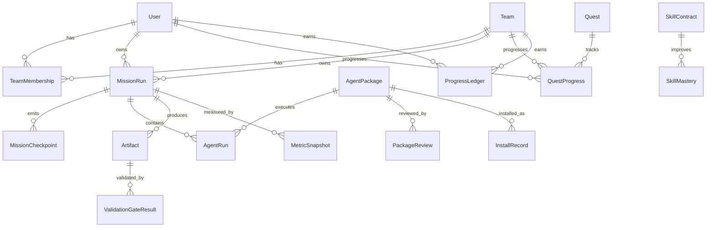

# Experience Layer System PRD

Status: Draft approved for implementation planning  
Owner: ROX ONE Agent Workbench  
Last updated: 2026-04-30

## 1. Reformulated Task

Build a switchable experience layer for ROX ONE Agent Workbench that turns the existing prompt/spec/agent/review product into a serious mission-control system by default, while allowing power users to toggle stronger Game and Arena modes.

The system must support:

- Command layer: serious mission control, metrics, gates, audit, budget, risk, owners.
- Game layer: quests, skill trees, achievements, streaks, agent XP, unlocks.
- Arena layer: 24h missions, boss runs, 100-agent swarm, ranked agents, leaderboards.
- Long-running background missions with 6h checkpoints and final verified deliverables.
- Agent collection, skill marketplace, agent forging, trust scores, and team/private registries.
- A single shared truth layer so UI style never changes quality, billing, permissions, audit, or validation semantics.

North Star:

```text
Verified Deliverable Index = did the raw idea become a reviewed, gated, auditable deliverable?
```

Submetrics:

- Quality Score: quality of prompt/spec formulation.
- Execution Readiness: readiness for agent execution.
- Verified Deliverable Index: verified outcome maturity.
- Cost Efficiency: VDI delta per credit/token/storage budget spent.

## 2. Assumptions and Boundaries

Assumptions:

- ROX ONE already has or is building prompt rewriting, spec building, review gates, user/team accounts, usage ledger, storage, and long-running agent execution primitives.
- The experience layer should sit above those primitives, not fork the core execution logic.
- Game/Arena modes are optional presentation and motivation layers. They cannot bypass validation gates.
- Paid plans may increase capacity, duration, storage, private agents, and swarm slots, but must never fabricate higher quality scores.
- Tests must use fake providers for LLM, storage, browser, billing, and scheduler paths.

Boundaries:

- This PRD does not implement real LLM orchestration, real billing, real public marketplace moderation, or production scheduler infrastructure.
- This PRD does define the data model, UI surfaces, implementation tickets, acceptance criteria, and test strategy required to implement the feature safely.
- Public marketplace is not MVP. MVP should use curated and team-private registries first.
- Transparent always-on autonomous work must require budget limits, permissions, audit logs, and human approval gates for expensive or risky branches.

## 3. Product Principle

The game layer motivates behavior, but truth remains operational.

```text
Experience layer changes presentation.
Core layer decides validity.
Validation gates decide quality.
Ledger decides cost.
Audit decides accountability.
```

Forbidden:

- Buying VDI directly.
- Completing quests without evidence.
- Unlocking agents without trust/permission checks.
- Running large swarm jobs without budget guardrails.
- Treating elapsed time as success. A 24h run ends in pass/warn/fail evidence, not just a timer.

## 4. Component and Screen Map

### Navigation

Primary surfaces:

- Composer
- Prompt Lab
- Spec Builder
- Deep Missions
- Agent Collection
- Arena Builder
- Mission Control
- Progression
- Quest Map
- Agent Forge
- Skill Marketplace
- Metrics
- Account / Team / Billing / Storage
- Audit Log

### Screen Hierarchy

1. Composer
   - Primary input
   - Mode selector
   - Rewrite / Think / Spec / Review / Deep Run / Arena buttons
   - Routes to Prompt Lab, Spec Builder, Deep Missions, or Review Board

2. Deep Missions
   - Long-running mission entry
   - 6h/24h/72h run presets
   - Mission type, cadence, budget, agent count, visibility
   - VDI target and checkpoint preview

3. Agent Collection + Arena Builder
   - Agent roster
   - Agent level, rarity, mastery, unlock criteria
   - Swarm slots and mission budget
   - Selected agents and run estimate

4. Mission Control Run Detail
   - Active run timeline
   - Checkpoints at 0h/6h/12h/18h/24h
   - Swarm feed
   - Validation gates
   - Human approvals
   - Interim artifacts
   - Audit and billing trace

5. Progression / Metrics Observatory
   - VDI and submetric dashboard
   - Command/Game/Arena toggle
   - Quests
   - Skill mastery
   - Economy ledger
   - Leaderboards
   - Integrity rules

6. Quest Map / Skill Tree / Unlocks
   - Campaign lanes: Formulate, Specify, Execute, Verify
   - Quest requirements
   - Evidence-gated completion
   - Unlock rules for agents, modes, and swarm capacity

7. Agent Forge / Skill Marketplace
   - Search and install agents/skills/packs
   - Forge new persona/skill
   - Trust score and forge test gauntlet
   - Package version lineage
   - Team/private registry first; public marketplace later

### Ownership

- Product owns modes, metrics, progression rules, copy, and monetization boundaries.
- Frontend owns navigation, shell, screen states, accessibility, and responsive behavior.
- Core/platform owns schemas, registries, schedulers, ledgers, permissions, and audit.
- Agent runtime owns mission execution, checkpoints, agent runs, provider abstraction, and fake test providers.
- Security owns package trust, permissions, prompt-injection tests, tenant isolation, and marketplace guardrails.
- QA owns gate definitions, TDD test fixtures, E2E mission scenarios, and regression matrix.

## 5. Visual Companion References

Wireframes created during brainstorming:

- `.superpowers/brainstorm/13590-1777560533/content/long-running-modes.html`
- `.superpowers/brainstorm/13590-1777560533/content/agent-collection-arena-builder.html`
- `.superpowers/brainstorm/13590-1777560533/content/mission-control-run-detail.html`
- `.superpowers/brainstorm/13590-1777560533/content/progression-metrics-observatory.html`
- `.superpowers/brainstorm/13590-1777560533/content/quest-map-skill-tree.html`
- `.superpowers/brainstorm/13590-1777560533/content/agent-forge-skill-marketplace.html`

## 6. Options and Tradeoffs

### Option A: Command-only Professional System

Pros:

- Enterprise-safe.
- Easier to explain.
- Lower UI risk.
- Less moderation/abuse risk.

Cons:

- Less habit-forming.
- Less differentiated.
- Weaker monetization surface for power users.
- Does not satisfy the desired "agent collection / arena / swarm" fantasy.

### Option B: Full Game Layer First

Pros:

- Strongest emotional hook.
- Clear progression and retention.
- Easier to sell power-user capacity.

Cons:

- Can look unserious.
- Risk of vanity metrics.
- More UI complexity.
- Harder enterprise adoption.

### Option C: Switchable Experience Layer

Pros:

- Enterprise-safe by default.
- Power users can enable Game/Arena intensity.
- Same data and validation model across all surfaces.
- Strong monetization without corrupting quality.

Cons:

- Requires strict shared schemas.
- Requires more careful UI architecture.
- Requires more tests because layers must not diverge.

Recommendation: Option C.

Default to Command. Let users enable Game and Arena. Store one truth layer and render it through different presentation modes.

## 7. Core Data Model



### Entities

#### ExperiencePreference

- id
- userId
- teamId optional
- defaultLayer: command | game | arena
- allowedLayers
- showLeaderboards
- showQuestLanguage
- showArenaLanguage
- createdAt
- updatedAt

#### MissionRun

- id
- ownerUserId
- teamId optional
- workspaceId
- sourceArtifactId optional
- mode: deep_run | deep_reasoning_lab | agenda_carnage | swarm_arena | round_table | autoresearch_loop | proactive_watchtower
- experienceLayer: command | game | arena
- title
- objective
- durationHours
- checkpointCadenceHours
- status: draft | queued | running | waiting_for_approval | paused | completed | failed | cancelled
- vdiTarget
- budgetCapCredits
- tokenCap
- storageCapBytes
- selectedAgentPackageIds
- requiredGateIds
- createdAt
- startedAt optional
- completedAt optional

#### MissionCheckpoint

- id
- missionRunId
- ordinal
- dueAt
- completedAt optional
- title
- summary
- artifactIds
- vdiDelta
- status: queued | running | completed | blocked | failed

#### AgentPackage

- id
- packageType: persona | skill | skill_pack | swarm_pack | review_pack
- name
- description
- ownerUserId optional
- ownerTeamId optional
- visibility: built_in | private | team | public
- rarity: common | rare | epic | legendary
- trustScore
- riskLevel
- permissionProfileId
- latestVersion
- pricingModel
- createdAt
- updatedAt

#### SkillContract

- id
- packageId
- inputSchema
- outputSchema
- examples
- requiredTools
- requiredPermissions
- requiredValidationGates
- failureModes
- testFixtures

#### AgentRun

- id
- missionRunId
- agentPackageId
- status
- startedAt
- completedAt
- contributionCount
- acceptedContributionCount
- duplicateContributionCount
- hallucinationPenalty
- costCredits
- confidence

#### Contribution

- id
- agentRunId
- claim
- evidenceRefs
- uniquenessScore
- severity
- accepted
- rejectionReason optional
- resultingArtifactId optional

#### MetricSnapshot

- id
- missionRunId optional
- artifactId optional
- userId optional
- teamId optional
- qualityScore
- executionReadiness
- verifiedDeliverableIndex
- costEfficiency
- openRiskScore
- noiseScore
- evidenceRefs
- createdAt

#### Quest

- id
- campaignId optional
- lane: formulate | specify | execute | verify | marketplace | team | arena
- defaultLayer: command | game | arena
- title
- description
- requirements
- rewards
- unlocks
- expiresAt optional

#### QuestProgress

- id
- questId
- userId optional
- teamId optional
- status: locked | available | active | completed | expired
- percent
- evidenceRefs
- completedAt optional

#### ProgressLedger

- id
- userId optional
- teamId optional
- eventType: xp | credit | entitlement | penalty | unlock
- amount
- currency: xp | credits | slots | storage | trust | mastery
- reason
- sourceArtifactId optional
- validationGateResultId optional
- createdAt

#### SubscriptionEntitlement

- id
- userId optional
- teamId optional
- planId
- swarmSlots
- maxMissionHours
- storageQuotaBytes
- privateAgentLimit
- publicMarketplaceAccess
- createdAt
- expiresAt optional

## 8. Metrics

### Quality Score

Measures prompt/spec quality:

- objective clarity
- constraints
- assumptions
- deliverables
- acceptance criteria
- open questions
- output contract

### Execution Readiness

Measures whether agents can execute:

- tasks exist
- dependencies mapped
- owners/roles assigned
- required tools allowed
- budget present
- validation gates attached
- TDD plan present

### Verified Deliverable Index

Suggested formula:

```text
VDI =
  0.20 * QualityScore
+ 0.20 * ExecutionReadiness
+ 0.25 * ValidationGatePassRate
+ 0.15 * ReviewResolutionRate
+ 0.10 * ArtifactCompleteness
+ 0.10 * ReproducibilityAuditScore
- 0.15 * CriticalOpenRiskPenalty
- 0.10 * UnsupportedClaimPenalty
```

### Agent XP

```text
AgentXP =
  acceptedUsefulContributions
+ severeFindingsAccepted
+ gatesImproved
+ verifiedArtifactImpact
- duplicateNoisePenalty
- hallucinationPenalty
- permissionViolationPenalty
```

### Skill Mastery

```text
SkillMastery =
  repeatedSuccessfulUse
+ evidenceBackedArtifactImpact
+ regressionPrevented
+ reviewAccepted
- staleOrUnsupportedOutput
```

## 9. Product Modes

### Deep Run 24h

Default checkpoints:

- 0h: mission brief
- 6h: first verdict and agenda attack
- 12h: spec/build pack
- 18h: swarm synthesis
- 24h: final verification and deliverable

Close condition:

- pass: final artifact exists, required gates pass, no unresolved critical findings
- warn: final artifact exists, non-critical issues remain
- fail: blocked, insufficient evidence, budget exhausted, or critical gates fail

### Deep Reasoning Lab

Purpose:

- multi-pass reasoning
- hypothesis tree
- contradiction map
- confidence decay
- final decision memo

### Agenda Carnage

Purpose:

- attack schedule, owners, dependencies, budgets, scope, hidden blockers
- produce severity-ranked fix plan

### Swarm Arena

Purpose:

- large parallel opinion gathering
- 100-agent capacity as paid/power-user mode
- strict dedupe, clustering, minority report, and noise penalties

### Knights Round Table

Purpose:

- curated senior roles instead of massive swarm
- Architect, Skeptic, QA, Researcher, Operator, Brand Judge, Closer

### Autoresearch Loop

Purpose:

- long-running research and fact freshness loop
- stale claims and source drift detection

### Proactive Watchtower

Purpose:

- background health monitor
- suggests next useful run based on logs, gates, open risks, and VDI opportunities

## 10. Automations

Event automations:

- On prompt submit: suggest mode and first quest.
- On spec generated: attach recommended gates and update Execution Readiness.
- On mission launch: create MissionRun, checkpoints, audit entry, budget reservation.
- On checkpoint due: run checkpoint executor and create interim artifact.
- On agent contribution accepted: update ProgressLedger and AgentRun counters.
- On validation gate pass/fail: update VDI and QuestProgress.
- On critical finding unresolved: block final pass and create fix task.
- On artifact verified: increment verified streak and unlock eligible rewards.
- On package installed: create InstallRecord and run trust checks.
- On package forged: run ForgeRun gauntlet before team/public publishing.

## 11. Security, Trust, and Abuse Controls

Required controls:

- Tenant isolation for team missions, private agents, and storage.
- Permission profiles for agents and skills.
- Prompt injection test suite for installable packages.
- Tool risk levels and explicit approvals for write actions.
- Budget reservation before long-running jobs.
- Hard cap enforcement for tokens, credits, storage, duration, and swarm slots.
- Audit log for mission state, approvals, costs, packages, and unlock events.
- Marketplace moderation before public listing.
- No permanent public artifact URLs for private team data.

## 12. Implementation Plan

Implement in small TDD tickets.

### T041 - Experience Layer Core Models

Goal:

- Add schemas/types/fixtures for ExperiencePreference, MissionRun, MissionCheckpoint, MetricSnapshot, Quest, QuestProgress, ProgressLedger, AgentPackage, SkillContract.

Tests first:

- schema validation
- default Command layer
- Game/Arena cannot change validation semantics
- VDI formula fixtures
- quest completion requires evidence
- paid entitlement cannot mark gates passed

### T042 - Experience Layer Registry

Goal:

- Add registry for Command/Game/Arena surfaces and mode visibility.

Tests first:

- every layer has labels and feature flags
- toggling layer preserves mission ids, artifacts, gates, ledger rows
- enterprise policy can disable Game/Arena

### T043 - Deep Missions Entry Screen

Goal:

- Implement Deep Missions screen from wireframe.

Tests first:

- render run presets
- budget cap required before launch
- checkpoint cadence preview
- launch disabled until required fields valid

### T044 - Arena Builder and Agent Collection

Goal:

- Implement agent roster, selected agents, swarm slots, run estimate.

Tests first:

- locked agents cannot be selected
- swarm count respects entitlement
- budget estimate updates
- selected agents persisted in draft run

### T045 - Mission Control Run Detail

Goal:

- Implement active run detail with timeline, gates, approvals, feed, artifacts, audit.

Tests first:

- checkpoint state transitions
- pending approval blocks expensive branch
- critical gate fail blocks final pass
- interim artifacts render by checkpoint

### T046 - Progression Observatory

Goal:

- Implement VDI dashboard, quests, skill mastery, economy ledger, leaderboards.

Tests first:

- metrics render from snapshots
- XP ledger requires evidence
- leaderboard privacy policy enforced
- paid capacity does not change quality score

### T047 - Quest Map and Skill Tree

Goal:

- Implement campaign lanes, quest state, unlock rules.

Tests first:

- quest requires artifact/gate evidence
- locked quests cannot be manually completed
- unlock rules evaluate deterministically
- Command view renders roadmap language; Game view renders quest language

### T048 - Agent Forge and Team Registry

Goal:

- Implement private/team registry, package contract, install, fork, forge gauntlet.

Tests first:

- package without contract cannot install
- trust score requires reviews/tests
- prompt injection warning blocks public publish
- team-private package not visible cross-tenant

### T049 - Long-running Mission Scheduler Adapter

Goal:

- Add scheduler abstraction with fake provider and checkpoint executor contract.

Tests first:

- due checkpoint creates run event
- idempotent checkpoint execution
- budget exhausted pauses mission
- cancelled mission does not execute future checkpoints

### T050 - Swarm Signal Processor

Goal:

- Add dedupe, clustering, contribution scoring, noise penalty.

Tests first:

- duplicate claims clustered
- accepted contribution increments XP
- unsupported claim penalized
- minority report retained

### T051 - Experience Layer E2E Scenario

Goal:

- E2E: create mission, select agents, launch fake run, advance checkpoint, accept contribution, pass gate, earn quest progress.

Tests first:

- no real LLM calls
- no real billing calls
- fake scheduler deterministic
- audit and ledger assertions included

### T052 - Security and Integrity Pass

Goal:

- Dedicated security pass across missions, packages, entitlements, ledgers, and team registry.

Tests first:

- cross-team mission denied
- cross-team package denied
- ledger spoofing denied
- entitlement bypass denied
- package permission escalation denied

## 13. Test Strategy

Minimum coverage by surface:

- Schemas: unit tests with valid/invalid fixtures.
- Metrics: deterministic formula tests and snapshot fixtures.
- UI: component tests for render, state changes, empty/loading/error states.
- Flows: integration tests with fake providers.
- Long-running jobs: fake scheduler tests with idempotency.
- Marketplace: contract, permission, trust, and package visibility tests.
- Security: tenant isolation, entitlement checks, permission denial, prompt injection baseline.
- E2E: fake mission from builder to checkpoint to VDI update.

Never use real providers in tests:

- no real LLM calls
- no real S3
- no real payment provider
- no real email
- no real public marketplace publication

## 14. Acceptance Criteria

Product acceptance:

- User can keep serious Command UI as default.
- User can toggle Game/Arena where policy allows.
- MissionRun data remains identical across layers.
- VDI is visible and evidence-backed.
- Quests require validation or artifact evidence.
- Paid features increase capacity only.
- Agent packages require contracts and trust checks.
- Long-running missions produce checkpoints and final pass/warn/fail result.
- Audit logs explain cost, approvals, gates, and rewards.

Engineering acceptance:

- All new schemas have tests.
- All UI flows have component tests.
- Mission scheduler has fake deterministic tests.
- Security/RBAC tests exist for team/private surfaces.
- E2E fake mission scenario passes.
- `bun run validate:agent-contract` passes.
- Relevant typecheck/test/build gates pass before completion.

## 15. Automatic Execution Prompt

The copy-paste prompt for Codex CLI is stored in:

```text
docs/prompts/experience-layer-autopilot.md
```

Use it to start the full TDD implementation loop from this PRD.
