# ROX.ONE v1.0.0 — End-to-End Dependency Graph

**Date:** 2026-05-13
**Sibling of:** `docs/superpowers/goals/2026-05-13-rox-one-v1-end-to-end-spine-goal.md`
**Purpose:** Single Mermaid diagram showing the full 46-phase dependency graph from current state to `v1.0.0` release and into post-release Lane P.

The spine file owns the *sequencing*; this file owns the *visual graph*. The `validate:roadmap-coherence` script asserts that every phase in this graph has a matching ledger row in the spine.

## Legend

- `[done]` filled green — already merged on `origin/main`
- `[next]` orange — the next phase the spine wants codex to do
- `[queued]` blue — waiting on a predecessor
- `[destructive]` red border — Phase R.11 (the one force-push)
- `[release]` purple — Phase M.21 (the v1.0.0 tag)
- Arrows: `A --> B` means B cannot start until A is `Status: DONE` and on `origin/main`.

## Full graph

```mermaid
flowchart TD
    %% =================================================================
    %% LANE M.1 — C.4 follow-ons (DONE)
    %% =================================================================
    subgraph M1["Lane M.1 — C.4 follow-ons (all DONE)"]
        direction TB
        M11["M.1.1 Workspace RPC<br/>8c1edf9"]:::done
        M12["M.1.2 Electron handlers<br/>9b29b30"]:::done
        M13["M.1.3 Server-core RPC<br/>T215 / ee47a29"]:::done
        M13b["M.1.3b Pi IPC<br/>T216 / 5e8b17a"]:::done
        M14["M.1.4 Tenant cred KDF<br/>baee220"]:::done
        M15["M.1.5 Audit storage (a-d)<br/>1e3c76e..ee49153"]:::done
        M16["M.1.6 Migration tool<br/>9ffb0a3"]:::done
        M17["M.1.7 T223 closeout<br/>f9ea575"]:::done
        M11 --> M12 --> M13 --> M13b --> M14 --> M15 --> M16 --> M17
    end

    %% =================================================================
    %% LANE R — Rebrand sweep
    %% =================================================================
    subgraph R["Lane R — Rebrand sweep (gated on M.1.7)"]
        direction TB
        R0["R.0 ADR 0011 + lint gates<br/>61016f9"]:::done
        R1["R.1 Surface text<br/>T263 (in flight)"]:::next
        R2["R.2 Code identifier renames<br/>T264-T266"]:::queued
        R3["R.3 Asset file renames<br/>T267-T268"]:::queued
        R4["R.4 Documentation cleanup<br/>T269-T272"]:::queued
        R5["R.5 Package scope rename<br/>T273-T284 (11 sub-phases)"]:::queued
        R6["R.6 Env-var rename + shim<br/>T285-T288"]:::queued
        R7["R.7 Docker / CI / build<br/>T289-T291"]:::queued
        R8["R.8 User-data migration<br/>T292-T294"]:::queued
        R9["R.9 Community-link audit<br/>T295"]:::queued
        R10["R.10 Final sweep + permanent gate<br/>T296-T297"]:::queued
        R0 --> R1 --> R2 --> R3 --> R4 --> R5 --> R6 --> R7 --> R8 --> R9 --> R10
    end

    %% =================================================================
    %% LANE M.2-M.20 — RBAC through RC validation
    %% =================================================================
    subgraph M2_20["Lane M.2 — M.20 — RBAC through RC"]
        direction TB
        M2["M.2 RBAC slice 6<br/>T223-T229"]:::queued
        M3["M.3 Upstream merge v0.9.3<br/>T230-T232"]:::queued
        M4["M.4 Account session persist<br/>T063"]:::queued
        M5["M.5 Public share shortlink<br/>T064 + T084"]:::queued
        M6["M.6 Production persistence<br/>T065"]:::queued
        M7["M.7 Real providers<br/>T067"]:::queued
        M8["M.8 Durable scheduler<br/>T066"]:::queued
        M9["M.9 Experience real-state<br/>T068, T074-T080"]:::queued
        M10["M.10 Composer Pillar 4<br/>T233+"]:::queued
        M11p["M.11 F.1 Shiki migration<br/>T241-T242"]:::queued
        M12p["M.12 Visual polish v2<br/>T069 + T081"]:::queued
        M13p["M.13 Security hardening<br/>T038, T052, T071, T086"]:::queued
        M14p["M.14 Observability + audit<br/>T039"]:::queued
        M15p["M.15 Test stab + E2E<br/>T034, T051, T082"]:::queued
        M16p["M.16 Bundle + perf budget<br/>T092, T118, T124"]:::queued
        M17p["M.17 Private CI/CD<br/>T070, T085"]:::queued
        M18["M.18 Mac trust boundary<br/>T033, T121, T122"]:::queued
        M19["M.19 Final RC docs<br/>T072, T087"]:::queued
        M20["M.20 RC validation + tag rc.1 + 72h soak"]:::queued
        M2 --> M3 --> M4 --> M5 --> M6 --> M7 --> M8 --> M9 --> M10
        M10 --> M11p --> M12p --> M13p --> M14p --> M15p --> M16p
        M16p --> M17p --> M18 --> M19 --> M20
    end

    %% =================================================================
    %% Destructive phase + release
    %% =================================================================
    R11["R.11 git filter-repo<br/>T298 (DESTRUCTIVE)"]:::destructive
    M21["M.21 v1.0.0 release<br/>tag + GitHub Release"]:::release

    %% =================================================================
    %% Post-release Lane P
    %% =================================================================
    subgraph P["Lane P — Post-release"]
        direction TB
        P1["P.1 v1.1.0 planning<br/>T300"]:::queued
        P2["P.2 Security monthly<br/>T301"]:::queued
        P3["P.3 Upstream auto-merge<br/>T302"]:::queued
        P4["P.4 Public announcement<br/>T303 (+72h soak)"]:::queued
        P5["P.5 Community onboarding<br/>T304"]:::queued
        P6["P.6 External contributors<br/>T305"]:::queued
        P1 --> P2
        P1 --> P3
        P1 --> P5
        P5 --> P6
    end

    %% =================================================================
    %% Cross-lane edges (the dependencies that matter most)
    %% =================================================================
    M17 --> R0
    R10 --> M2
    M20 --> R11
    R11 --> M21
    M21 --> P1
    M21 --> P4

    %% =================================================================
    %% Hard constraint: M.3 requires R.5-R.7 done (no @craft re-introduction)
    %% =================================================================
    R7 -. "R.5-R.7 must precede M.3<br/>(prevents @craft-agent re-introduction from upstream)" .-> M3

    classDef done fill:#d4edda,stroke:#155724,stroke-width:2px,color:#000
    classDef next fill:#fff3cd,stroke:#856404,stroke-width:3px,color:#000
    classDef queued fill:#cfe2ff,stroke:#0c5394,stroke-width:1px,color:#000
    classDef destructive fill:#f8d7da,stroke:#721c24,stroke-width:3px,color:#000
    classDef release fill:#e2d9f3,stroke:#5e3c99,stroke-width:3px,color:#000
```



## Critical path

The longest path through this graph (the path that determines the total elapsed time to `v1.0.0`) is:

```
M.1.7 (DONE) → R.0 (DONE) → R.1 → R.2 → R.3 → R.4 → R.5 (5 days, 11 sub-phases)
            → R.6 → R.7 → R.8 → R.9 → R.10 → M.2 → M.3 (4 days, upstream merge)
            → M.4 → M.5 → M.6 → M.7 → M.8 → M.9 → M.10 → M.11 → M.12 → M.13
            → M.14 → M.15 → M.16 → M.17 → M.18 → M.19 → M.20 (3 days RC + 72h soak)
            → R.11 (1 day, force-push) → M.21 (1 day, tag + release)
```

**29 phases on the critical path.** Total estimated duration: 55 days starting 2026-05-13.

## Phases NOT on the critical path

- **Lane P** phases run *after* M.21 in parallel with each other (except P.6 which gates on P.5).
- **M.1.x** sub-phases (all DONE) are off the critical path now that M.1.7 has landed.
- **R.5 sub-phases** R.5.1 through R.5.11 are sequential among themselves but the entire R.5 block is one critical-path node.

## How to use this graph

1. **Codex resumption:** read this graph, find the first `[next]` or `[queued]` node whose predecessors are all `[done]`. That's the next phase.
2. **Human review:** scan visually for any node missing a predecessor edge (indicates a roadmap drift bug).
3. **CI validation:** `scripts/validate-roadmap-coherence.cjs` parses this Mermaid block and asserts every node ID matches a phase row in the spine ledger.

## Rendering this diagram locally

```bash
# With the Mermaid CLI:
npx -y @mermaid-js/mermaid-cli -i docs/release/v1-end-to-end-dependency-graph.md \
  -o /tmp/v1-graph.svg --width 2400 --height 1800
xdg-open /tmp/v1-graph.svg
```

GitHub renders the Mermaid block inline in the file view at `https://github.com/agisota/rox-one-terminal/blob/main/docs/release/v1-end-to-end-dependency-graph.md` automatically.
