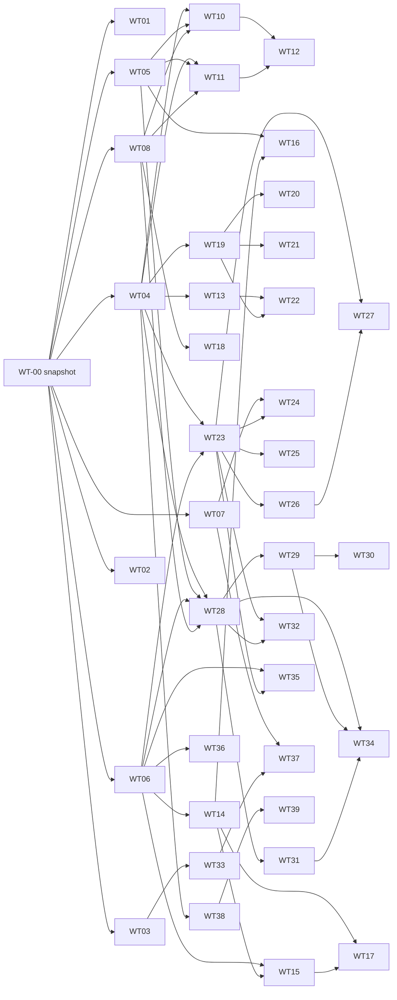

# ROX.ONE Parallel Worktree Harness — Master Design

**Дата:** 2026-05-21
**Статус:** Design — approved, awaiting per-WT spec generation
**Base commit:** `fac6f228069c` (branch `release/v1.0.3-launch-fixes`)
**Авторы:** консолидация ROX.ONE original plan + Codex addendum 2026-05-20 + enterprise harness extension

---

## 0. Executive Summary

ROX.ONE расширяется от desktop-агент-workbench к **enterprise agentic harness** через одновременный многопоточный rollout 40 продуктовых worktree + 5 research spike. Каждый WT — изолированная git-ветка с жёстким file-allowlist, собственным 14-ролевым swarm-координатором, TDD-first lifecycle, 3-machine verification и feature-flag rollout. Master orchestrator управляет lifecycle всех WT, контролирует merge train и синхронизирует прогресс в Linear (PZD) + Featurebase (roadmap.rox.one).

**Ключевые принципы:**

1. **Изоляция через allowlist** — каждый WT может изменять только декларированные файлы. Shared scaffolds (`package.json`, `tsconfig.json`, root locale files) принадлежат одному WT-владельцу; остальные подают «scaffold-extension request».
2. **TDD first** — все production WT начинают с failing tests, написанных opus-max-reasoning ролью.
3. **Feature flags + sequential merge** — каждый WT мерджится за фича-флагом (default OFF). Master orchestrator определяет topological order и проводит каждый merge через единый gate (typecheck + lint + tests + 3-machine builds + screenshots).
4. **14-ролевой swarm** — каждый WT-координатор разворачивает до 14 sub-agent ролей через 5 phase lifecycle (Discovery → Design → Implementation → Verification → Optimization).
5. **Модели по правилу** — opus-4.7 MAX reasoning для test development / verification / planning / prompt writing / brainstorming / critique / orchestration; sonnet-4.6 MEDIUM для tactical implementation.
6. **Доказательная база** — никакой merge без 3-machine screenshots/builds/logs, аттаченных к Linear issue.

**Метрики успеха:**

- 40 WT параллельно: ~30-50 коммитов/день при максимальной пропускной способности
- Merge train: 1 merge/час с full gate (24-30 merges/день)
- Conflict rate: <5% (благодаря file-allowlist)
- Regression rate: <2% (благодаря 3-machine verification + feature flags)
- Time-to-rollout (Wave 1 + 2): 14-21 день при 24/7 agent ops

---

## 1. Consolidated State Audit

### 1.1 Что уже сделано (Linear + Featurebase + Repo)

| Источник | Состояние | Соответствие изначальному плану |
|---|---|---|
| Repo `agisota/rox.one` | branch `release/v1.0.3-launch-fixes`, SHA `fac6f228069c`; recent hotfix mac DMG skip | ROX Design + multiplatform приоритеты соответствуют |
| Linear PZD (org `kuhjie`) | 457 issues, 13 эпиков E01-E13, 12 sub-projects | E01-E12 покрывают core; E13 misc; **не покрывают** новые слои harness |
| Featurebase `roadmap.rox.one` | 452 roadmap posts + 39 live changelogs | Отражает текущий план; **не отражает** Cloudflare enterprise extension |
| ROX Design / Open Design | Runtime/view/bridge/policy модули в репо, branch security hardening ongoing | Соответствует WT-02 (security) + WT-03 (UX) |
| Multiplatform | Linux DEB/RPM/AppImage готовы, NixOS flake мерджен, Mac diagnostics, Win self-signed plan | Соответствует WT-01 |

### 1.2 Гэпы vs изначальный план (твои слои)

Codex addendum (2026-05-20) дал 18 WT; твой layer list требует декомпозиции до ~40:

| Слой из твоего плана | Codex covered? | Decomposition |
|---|---|---|
| User data (identity, profile) | WT-04 (one big contract) | Расщеплено → WT-04, WT-05, WT-06, WT-07, WT-08 |
| Телеметрия | WT-06 (one big) | WT-08 + WT-18 (query API) |
| Регистрация | WT-07 (auth/SCIM lumped) | Расщеплено → WT-10, WT-11, WT-12, WT-13 |
| Реферальный баланс | WT-17 (lumped with crypto+billing) | Расщеплено → WT-41 spike (crypto) отдельно от ledger |
| Уведомления | WT-09 (lumped with mailbox) | Расщеплено → WT-19, WT-20, WT-21, WT-22 |
| Регистрация почтового ящика на нашем домене | WT-09 (in name only) | WT-22 dedicated |
| Присвоение юзернейма | WT-09 (one sentence) | WT-13 dedicated |
| Командный слой | WT-08 (one big) | Расщеплено → WT-14, WT-15, WT-16, WT-17, WT-18 |
| Модернизация prompt-пространства | WT-12 (lumped with UI) | Расщеплено → WT-33, WT-34 |
| Наполнительные подключения (sources/MCP) | WT-13 (one big) | Расщеплено → WT-38, WT-39 |
| Локация мест на диске на сервере (drive) | WT-10 (lumped) | Расщеплено → WT-23, WT-24, WT-25, WT-26, WT-27 |
| Изоляция БД, бэкапы, дедупликация | WT-10 (lumped) | WT-25 (dedup) + WT-26 (backup+numbering) + WT-27 (versioning) |
| Оплата крипта | WT-17 (lumped) | WT-41 spike (research only) |
| Возможности юзера на новые/старые функции | WT-04 (mentioned) | WT-07 (Entitlement engine) + WT-37 (UI surface) |
| Дополнительные указания экранов (contextual hints) | **missing** | WT-37 (Onboarding/hints) добавлено |
| Cloudflare One mesh / NextDNS status | WT-18 (lumped with RBI/cert) | WT-43 spike (mesh topology) отдельно |

### 1.3 Что не входит в этот цикл (defer)

- Production self-issued root certificate install (legal+policy review → WT-44 spike only)
- Production crypto payment custody (legal review → WT-41 spike only)
- Production mesh deployment к non-managed devices (WT-43 spike → enterprise decision)
- Mobile clients (iOS/Android) — отдельный roadmap, не в этих 40 WT

---

## 2. Design Principles

### 2.1 File-allowlist (предотвращение merge conflicts)

Каждый WT декларирует `files_allowed` (positive globs) и `files_forbidden` (negative globs) в `wt-meta/wt-XX.yaml`. Coordinator agent отказывается изменять файлы вне списка. Pre-merge gate выполняет `git diff --name-only origin/main..HEAD` и сверяет с allowlist — любой файл вне списка блокирует merge.

**Shared scaffolds + ownership:**

| Файл/тип | Owner WT | Другие WT |
|---|---|---|
| `package.json`, root | WT-00 | Подают scaffold-extension request с reason + dep name + version |
| `tsconfig*.json` | WT-00 | scaffold-extension request |
| `bun.lock` | WT-00 | автоматически обновляется WT-00 на каждый merge |
| Root `AGENTS.md` | WT-00 | scaffold-extension request |
| `apps/electron/src/main/locales/*.json` (i18n) | WT-20 | scaffold-extension request с конкретным ключом |
| `packages/shared/src/core/*` (data contracts) | WT-04..WT-08 | read-only после merge |
| `infra/cloudflare/*` | WT-01 + WT-10 (shared) | по согласованию через wt-meta |
| `electron-builder.yml` | WT-01 | WT-02 имеет partial ownership на rox-design-* keys |

Scaffold-extension request flow:
1. WT-X создаёт `wt-meta/scaffold-requests/wt-X-to-wt-00-<file>-<reason>.yaml`
2. WT-00 coordinator processes request на каждой Phase 5 cycle
3. WT-00 делает single commit per request and merges first
4. WT-X rebases и продолжает

### 2.2 TDD-first lifecycle

Все production WT (WT-00 до WT-39) начинают Phase 3 (Implementation) с opus-max test-writer agent, который создаёт `failing tests` ПЕРЕД любым impl-кодом. Тесты commit'ятся в первом impl-коммите; затем `implementer` agent заполняет до прохождения.

**Жёсткое правило:**
- `git log --oneline <branch>` должен показывать: `test(...): failing tests for X` ДО `feat(...): implement X`
- Pre-merge gate проверяет это: если test-commit отсутствует или импл-коммит идёт первым → merge blocked

### 2.3 Feature flags + sequential merge

Каждый WT добавляет фичу за feature flag (`packages/shared/src/feature-flags/registry.ts`). Default value:

- **OFF** — для всех Wave 1 + Wave 2 WT, пока release cut не включит флаг
- **OFF** для production, **ON** в dev/test profiles

Master orchestrator определяет release cut порядок:
1. **Foundation cut** (Wave 0 WT): включить как только все Wave 0 merged
2. **Auth cut** (WT-10..18): после полного зелёного gate + RBAC isolation tests
3. **Storage cut** (WT-19..27): после Auth cut + smoke
4. **Agent fabric cut** (WT-28..32)
5. **UI cut** (WT-33..37)
6. **Sources cut** (WT-38..39)

Merge train полностью sequential — один merge за раз. Параллельность достигается в WT работе, не в merge.

### 2.4 14-role swarm

Каждый WT-coordinator agent разворачивает 14 ролей через 5 phases. Roles ↔ phases mapping в Section 3.

### 2.5 Model selection rule

По твоему правилу:

> «TEST DEVELOPMENT + VALIDATION/VERIFICATION + PLANNING + PROMPT/INSTRUCTION WRITING + BRAINSTORMING + CRITIQUE + ORCHESTRATION → opus-4.7 MAX reasoning. Other → MEDIUM reasoning.»

Результат:

| Phase | Roles | Model |
|---|---|---|
| Discovery | brainstormer, requirements-keeper, scope-analyzer, critic | opus-4.7-max |
| Design | prompt/plan/spec-writer, architect, UX-guru | opus-4.7-max |
| Implementation: tests | test-writer | opus-4.7-max |
| Implementation: code | implementer, ultra-super-coder | sonnet-4.6-medium |
| Implementation: review | reviewer | opus-4.7-max |
| Verification | verifier, critic, integrator | opus-4.7-max |
| Optimization | optimizer, 10x-improver | opus-4.7-max |
| Master orchestrator | (single global) | opus-4.7-max |

**12 opus-max roles + 2 medium roles** per WT. Master orchestrator opus-max единый.

Cost cap: master orchestrator поддерживает `max_opus_seconds_per_day` budget; при превышении деградирует не-критичные роли (10x-improver, Elon-optimizer) до sonnet-medium.

### 2.6 3-machine verification protocol

Каждый WT, который touches UI / packaging / signing / release / security, обязан предоставить evidence с 3 машин перед merge:

| Machine | Runner | What proves |
|---|---|---|
| `mac-14-arm` | GitHub-hosted macOS 14 ARM | Code builds, types check, electron app launches, screenshot OK |
| `windows-2022` | GitHub-hosted Windows 2022 | Code builds, types check, electron app launches, self-signed signature валиден |
| `ubuntu-22` | GitHub-hosted Ubuntu 22.04 | Code builds, types check, electron AppImage launches, smoke OK |

Evidence файлы хранятся в `evidence/wt-XX/<machine>/`:
- `screenshot.png` — главное окно или test fixture
- `build.log` — full build output
- `smoke-result.json` — `{ duration_ms, smoke_steps: [{name, status}] }`
- `signature-status.json` (Windows only) — signature verification output

При impossible-on-CI ситуации (например, real Mac Notarization без developer ID) WT spec явно указывает причину + manual test instructions + attaches evidence от человека-тестера.

### 2.7 Linear/Featurebase sync rules

**Linear sync (Rox/PZD team, `86e0ae89-3cf0-43b7-b363-0433b9f47319`):**

- Каждый WT → sub-issue под соответствующим эпиком (E01-E12 / PZD-112..123)
- Sub-issue имеет sub-tasks per phase (discovery/design/impl/verify/optimize)
- Sub-issue имеет attachment с FB roadmap post URL (bidirectional link уже работает)
- Sub-issue получает audit comments на каждое phase-completion
- Master orchestrator поддерживает statuses через Linear GraphQL: Triage → In Progress → In Review → Done

**Featurebase sync (`do.featurebase.app/v2`, tenant `roadmap.rox.one`):**

- Каждый WT → roadmap post в соответствующий board (по типу: Frictionless UX / Bugs / Compounding / Enterprise / Wishlist)
- Post создаётся на старте WT, status="Planned"
- На phase=impl: status="In Progress"
- На merge: status="Shipped" + автоматически draft changelog
- Каждый release cut публикует все pending changelogs

---

## 3. Master Orchestrator Architecture

```
┌────────────────────────────────────────────────────────────────────┐
│                  MASTER ORCHESTRATOR AGENT                         │
│                                                                    │
│   • model: opus-4.7-max                                            │
│   • lives in: scripts/orchestrator/master.ts                       │
│   • cron: every 15 minutes (state sync + merge gate check)         │
│   • state: .orchestrator/state.json                                │
│                                                                    │
│   Capabilities:                                                    │
│   ├─ load_wt_metas()           — read 40 yaml files               │
│   ├─ topological_sort()        — compute merge order              │
│   ├─ spawn_coordinator(wt_id)  — start a worktree coordinator     │
│   ├─ check_merge_gate(wt_id)   — run full gate                    │
│   ├─ merge_to_main(wt_id)      — execute git merge                │
│   ├─ rotate_flag(flag)         — flip feature flag                │
│   ├─ sync_linear(wt_id)        — push status to Linear            │
│   ├─ sync_featurebase(wt_id)   — push to FB                       │
│   └─ generate_report()         — daily status report              │
└────────────────────────────────────────────────────────────────────┘
                  │
                  ├─ spawn 40+ coordinator agents
                  ▼
┌─────────────────────────────────────────────────────────────────────┐
│            WT-COORDINATOR AGENT (one per worktree, opus-4.7-max)    │
│                                                                     │
│   Lives in: git worktree at `wt-XX-<topic>/`                        │
│   Reads: wt-meta/wt-XX.yaml                                         │
│   Writes: evidence/wt-XX/, .coordinator/state.json                  │
│                                                                     │
│   Phase loop (until verification passes OR cancelled):              │
│   ├─ Phase 1: Discovery (parallel sub-agents)                       │
│   ├─ Phase 2: Design                                                │
│   ├─ Phase 3: Implementation (TDD-first)                            │
│   ├─ Phase 4: Verification (3-machine)                              │
│   ├─ Phase 5: Optimization                                          │
│   └─ Phase 6: Signal "ready-to-merge" → Master orchestrator         │
└─────────────────────────────────────────────────────────────────────┘
                  │
                  ├─ spawn 14 role sub-agents (per phase)
                  ▼
┌─────────────────────────────────────────────────────────────────────┐
│   ROLE SUB-AGENT (ephemeral, one per role invocation)               │
│                                                                     │
│   • model: per Section 2.5 rule                                     │
│   • lives: in WT-coordinator's worktree                             │
│   • reads: WT spec, current code, prior role outputs                │
│   • writes: own role output file (e.g. `tests/__tests__/...`)       │
│   • returns: structured JSON {status, artifacts, blockers}          │
└─────────────────────────────────────────────────────────────────────┘
```

### 3.1 wt-meta/wt-XX.yaml schema

```yaml
# Декларативная конфигурация worktree

id: WT-XX
title: "..."
branch: feat/...
base_sha: fac6f228069c           # pinned from WT-00 snapshot
worktree_path: ../wt-XX-<topic>  # git worktree --add target

# Feature flag (gates production exposure)
feature_flag:
  name: rox.feature.<key>
  default: off
  release_cut: foundation|auth|storage|agent|ui|sources

# Priority & wave
priority: P0|P1|P2|P3
wave: 0|1|2|3

# File scope — STRICT enforcement
files_allowed:                    # positive globs
  - apps/electron/src/main/auth/access-jwt/**
  - packages/shared/src/auth/access-jwt/**
  - tests/unit/auth/access-jwt/**.test.ts
files_forbidden:                  # explicit no-touch (overrides allowed)
  - package.json
  - tsconfig.json
  - apps/electron/src/main/auth/oauth/**   # belongs to existing system

# Dependencies (topological merge order)
depends_on: [WT-04, WT-08]        # cannot merge before these are in main
blocks: [WT-15, WT-18]            # are blocked by this WT

# Scaffold extension requests (для shared files)
scaffold_requests:
  - target_file: package.json
    target_owner: WT-00
    reason: "add @cloudflare/access-jwt-validator dependency"
    proposed_change_summary: "{ deps: { @cloudflare/...: ^1.2.0 } }"

# 14-role swarm configuration
roles:
  discovery: [brainstormer, requirements-keeper, scope-analyzer, critic]
  design:    [prompt-writer, architect, ux-guru]              # ux-guru only if UI
  impl:      [test-writer, implementer, super-coder, reviewer]
  verify:    [verifier, critic, integrator]
  optimize:  [optimizer, 10x-improver]

# Model overrides (default per Section 2.5)
model_overrides: {}

# Verification protocol
verification:
  machines: [mac-14-arm, windows-2022, ubuntu-22]
  screenshots_required: true
  smoke_tests: [auth-login, session-create]
  electron_build: true|false
  packaging_required: false

# Linear integration
linear:
  parent_epic_identifier: PZD-113     # E02 Auth
  child_story_titles:
    - "🔧 Задача — Cloudflare Access JWT validator"
    - "🔧 Задача — JWT claim mapping → rox session"
  existing_issues_to_attach: [PZD-263, PZD-264]

# Featurebase integration
featurebase:
  board_id: 6a0db1dabaed70b5d8d3f898  # enterprise-b2b
  post_alias: wt-10-access-jwt-validator
  status_lifecycle: [planned, in-progress, shipped]

# Inspiration repos (subset from 200-classified)
inspiration_repos:
  - url: https://github.com/cloudflare/access-jwt-validator-example
    integration_type: reference_only
    rationale: "Pattern for JWKS rotation + claim extraction"

# Definition of done (gating list — все обязаны быть true для merge)
definition_of_done:
  - tests_first_commit_exists: true
  - typecheck_passes: true
  - lint_passes: true
  - unit_tests_pass: true
  - integration_tests_pass: true
  - electron_builds_mac: true
  - electron_builds_win: true
  - electron_builds_linux: true
  - screenshots_present: true
  - smoke_passes_3_machines: true
  - rbac_isolation_tests_pass: true
  - audit_emit_tests_pass: true
  - feature_flag_off_no_visible_change: true
```

### 3.2 Coordinator state schema

`.coordinator/state.json`:
```json
{
  "wt_id": "WT-10",
  "current_phase": "Implementation",
  "phase_progress": {
    "discovery": { "status": "complete", "artifacts": ["docs/wt-10-discovery-notes.md"] },
    "design": { "status": "complete", "artifacts": ["docs/wt-10-implementation-plan.md"] },
    "impl": { "status": "in_progress", "subphase": "tests_passing_impl" },
    "verify": { "status": "pending" },
    "optimize": { "status": "pending" }
  },
  "last_role_invocations": [
    { "role": "test-writer", "started_at": "...", "completed_at": "...", "tokens": 12345 }
  ],
  "blockers": [],
  "merge_ready": false
}
```

---

## 4. 14-Role Swarm + Model Selection

### 4.1 Phase 1 — Discovery (opus-4.7-max, parallel)

| Role # | Name | Goal | Output |
|---|---|---|---|
| 10 | brainstormer / thinking partner / architect / SWE | Что строим, зачем, как соотносится с продуктом | `discovery/01-vision.md` |
| 11 | requirements-keeper / source of truth / DoD-keeper | Minimum DoD list, AC numbered | `discovery/02-requirements.md` |
| 1 | scope-analyzer | Files in scope, deps, conflicts с существующим кодом | `discovery/03-scope.md` + diff against `files_allowed` |
| 6 | critic (state-of-the-art performance focus) | What's missing, anti-patterns, perf risks | `discovery/04-critique.md` |

**Coordinator merges 4 outputs → `discovery/_summary.md`** (sub-agent role: integrator).

### 4.2 Phase 2 — Design (opus-4.7-max, sequential)

| Role # | Name | Goal | Output |
|---|---|---|---|
| 12 | prompt/plan/spec-writer | Implementation plan (детальный TDD план) | `design/01-impl-plan.md` |
| 10 | brainstormer (review) | Peer review of plan | `design/02-plan-review.md` |
| 14 | UX-guru | Wireframe + style tokens (if UI involved) | `design/03-ux-spec.md` |

### 4.3 Phase 3 — Implementation (mixed models)

| Role # | Name | Model | Goal |
|---|---|---|---|
| 2 | test-writer | opus-4.7-max | Failing tests first commit |
| 3 | implementer | sonnet-4.6-medium | Basic implementation passing tests |
| 13 | ultra-super-coder | sonnet-4.6-medium | Refactor + perf |
| 4 | reviewer | opus-4.7-max | In-WT code review before phase 4 |

**Hard rule:** test-writer COMMITS first. Pre-merge gate verifies `git log --oneline | head -5` shows test-commit before any feat-commit.

### 4.4 Phase 4 — Verification (opus-4.7-max, sequential)

| Role # | Name | Goal | Output |
|---|---|---|---|
| 5 | verifier | Run ALL gates: typecheck, lint, test, 3-machine builds, screenshots | `verification/gates-report.json` |
| 6 | critic | "Соответствует ли результат AC из discovery?" | `verification/critique-vs-ac.md` |
| 7 | integrator / frictionless keeper | "Merge готов? Conflicts с другими WT?" | `verification/integration-readiness.md` |

### 4.5 Phase 5 — Optimization (opus-4.7-max, parallel)

| Role # | Name | Goal | Output |
|---|---|---|---|
| 8 | optimizer / Elon Musk | Perf, bundle, cost wins | `optimization/01-perf-wins.md` |
| 9 | 10x-improver / one-more-thing | Next-leap opportunities — НЕ MERGED, только noted | `optimization/02-future-leaps.md` |

**Phase 5 outputs не блокируют merge** — это recommendations для следующих WT.

---

## 5. 40 Worktrees + DAG

### 5.1 Полный список

(см. Section 3 предыдущего сообщения, повторяется для self-contained)

**Wave 0 — Foundation (10 WT):**

| WT | Branch | Owns shared scaffold? |
|---|---|---|
| WT-00 | `chore/snapshot-2026-05-21` | Yes — `package.json`, `tsconfig*`, root `AGENTS.md` |
| WT-01 | `feat/release-r2-on-merge` | Yes — `electron-builder.yml`, `.github/workflows/*` |
| WT-02 | `fix/rox-design-security` | Partial — `rox-design-*` keys in electron-builder.yml |
| WT-03 | `feat/rox-design-topbar` | No |
| WT-04 | `feat/contract-user-identity` | Yes — `packages/shared/src/core/user.ts` |
| WT-05 | `feat/contract-tenant-org` | Yes — `packages/shared/src/core/tenant.ts` |
| WT-06 | `feat/contract-workspace-team` | Yes — `packages/shared/src/core/workspace.ts` |
| WT-07 | `feat/contract-entitlement-flags` | Yes — `packages/shared/src/feature-flags/registry.ts` |
| WT-08 | `feat/contract-audit-telemetry` | Yes — `packages/shared/src/audit/` |
| WT-09 | `chore/linear-fb-sync` | No |

**Wave 1 — Auth + Team + Notifications + Storage (22 WT):**

| WT | Branch | Depends |
|---|---|---|
| WT-10 | `feat/access-jwt` | 04, 05, 08 |
| WT-11 | `feat/scim-receiver` | 04, 05, 08 |
| WT-12 | `feat/account-linking-jit` | 10, 11 |
| WT-13 | `feat/username-claim` | 04 |
| WT-14 | `feat/roles-engine` | 06 |
| WT-15 | `feat/membership-invite` | 06, 14 |
| WT-16 | `feat/tenant-isolation-tests` | 05, 14 |
| WT-17 | `feat/rbac-admin-ui` | 14, 15 |
| WT-18 | `feat/audit-log-query` | 08 |
| WT-19 | `feat/email-provider` | 04 |
| WT-20 | `feat/email-templates` | 19 |
| WT-21 | `feat/notif-prefs-ui` | 19 |
| WT-22 | `feat/mailbox-domain` | 13, 19 |
| WT-23 | `feat/storage-backend` | 04, 06 |
| WT-24 | `feat/quota-engine` | 07, 23 |
| WT-25 | `feat/dedup-engine` | 23 |
| WT-26 | `feat/backup-restore` | 23 |
| WT-27 | `feat/soft-delete-versioning` | 23, 26 |

**Wave 2 — Agent Fabric + UI + Sources (12 WT):**

| WT | Branch | Depends |
|---|---|---|
| WT-28 | `feat/coordinator-agent` | 04, 05, 06, 08 |
| WT-29 | `feat/task-dag-runner` | 28 |
| WT-30 | `feat/queue-fanout` | 29 |
| WT-31 | `feat/realtime-ws` | 28 |
| WT-32 | `feat/evidence-store` | 23, 28 |
| WT-33 | `feat/prompt-workspace-v2` | 03 |
| WT-34 | `feat/agent-run-ui` | 28, 29, 31 |
| WT-35 | `feat/notes-mvp` | 06, 23 |
| WT-36 | `feat/day-tracking-mvp` | 06 |
| WT-37 | `feat/onboarding-hints` | 07, 33 |
| WT-38 | `feat/source-registry-contract` | 04 |
| WT-39 | `feat/mcp-connector-packs` | 38 |

**Wave 3 — Research spikes (5, parallel, no merge):**

| Spike | Topic | Output |
|---|---|---|
| WT-40 | Mail/Calendar read-only research | Decision doc + mock contracts |
| WT-41 | Crypto payment provider | Provider matrix + custody risk doc |
| WT-42 | Cloudflare RBI launch flow | Demo + policy spec |
| WT-43 | Cloudflare Mesh / NextDNS topology | Topology + status spec |
| WT-44 | Self-issued root cert legal/policy | Compliance doc |

### 5.2 Dependency DAG (Mermaid)



### 5.3 Critical path

Самый длинный путь зависимостей:

```
WT-00 → WT-04 → WT-23 → WT-28 → WT-34 (agent-run-ui)
```

5 шагов. Минимальный возможный time-to-Wave-2-complete: 5 × (avg WT duration). При 4-6 часах на WT (включая все 5 phases с opus-max) — **2-3 дня минимум** на critical path. Wave 3 (research spikes) параллельны и не на critical path.

---

## 6. Merge Train + 3-Machine Verification + Linear/FB Sync

### 6.1 Merge gate

Каждый merge WT-XX → main проходит через единый gate:

```
1. Verify branch base matches origin/main (rebase if not)
2. Verify diff matches files_allowed (no out-of-scope files)
3. Verify test-commit exists before feat-commits
4. Run: bun run typecheck (must exit 0)
5. Run: bun run lint (must exit 0)
6. Run: bun test --scope=<WT files> (must exit 0)
7. Run: bun run validate:ci (must exit 0)
8. Trigger 3-machine GitHub Actions:
   - mac-14-arm: build + smoke + screenshot
   - windows-2022: build + signature + smoke
   - ubuntu-22: build + AppImage smoke
9. Verify all 3 evidence files present + size > 0 + smoke status=pass
10. Verify Linear sub-issue status = "Ready for Merge"
11. Verify wt-meta.yaml definition_of_done all true
12. Execute: git merge --no-ff <branch>
13. Push origin/main
14. Update Linear sub-issue status = "Done"
15. Update FB post status = "Shipped"
16. Generate FB draft changelog
```

Любой fail = merge blocked, WT возвращается в Phase 4 (Verification) с указанием blocker.

### 6.2 Conflict resolution

Если 2 WT touch same file (через scaffold-extension request к WT-00):
- WT-00 processes requests in FIFO order per merge cycle
- Late-arrival WT rebases от updated WT-00 commit
- Pre-merge gate автоматически проверяет, что branch базируется на latest origin/main

Если 2 WT immer same file ОБХОДОМ allowlist (bug в coordinator) — pre-merge gate их блокирует. Manual resolution by master orchestrator (opus-max) с дополнительным critic-pass.

### 6.3 Release cuts

После каждой waves merge — release cut:

| Cut | When | Flags enabled |
|---|---|---|
| Foundation Cut | Wave 0 complete | rox.feature.contracts.v1, rox.feature.audit.baseline |
| Auth Cut | WT-10..18 merged + isolation tests green | rox.feature.access-jwt, rox.feature.scim, rox.feature.rbac.v1 |
| Notifications Cut | WT-19..22 merged | rox.feature.email-provider, rox.feature.mailbox.user-at-rox |
| Storage Cut | WT-23..27 merged + backup tests | rox.feature.drive.v1, rox.feature.quota, rox.feature.dedup |
| Agent Fabric Cut | WT-28..32 merged | rox.feature.agent-fabric.v1, rox.feature.realtime-ws |
| UI Cut | WT-33..37 merged | rox.feature.prompt-v2, rox.feature.agent-run-ui, rox.feature.notes-mvp |
| Sources Cut | WT-38..39 merged | rox.feature.source-registry, rox.feature.mcp-packs |

Каждый cut — separate commit на main с `feat(release): cut <name>` + tag.

### 6.4 Linear sync — full lifecycle

```
On WT-XX start (Phase 1):
  → Create Linear sub-issue under parent_epic
  → Status: Triage
  → Add comment: "Discovery phase begun"
  → Set parent_id to parent_epic UUID

On Phase=Design:
  → Add comment with link to design/01-impl-plan.md
  → Status: In Progress

On Phase=Implementation:
  → Sub-task: "Tests written (TDD-first commit)"
  → Sub-task: "Implementation passing tests"
  → Status: In Progress

On Phase=Verification:
  → Sub-task: "3-machine verification"
  → Add attachments: evidence/wt-XX/{mac,win,linux}/* (screenshots + logs)
  → Status: In Review

On Merge to main:
  → Status: Done
  → Add comment: "Merged in commit <SHA>"
  → Close sub-task tree

On Release Cut (feature flag ON):
  → Add comment: "Feature flag rox.feature.X = ON (release cut <name>)"
```

### 6.5 Featurebase sync — full lifecycle

```
On WT-XX start:
  → Create roadmap post on appropriate board (per wt-meta.yaml)
  → status="Planned"
  → content: WT title + short scope + AC summary + inspiration repos

On Phase=Implementation:
  → PATCH post status="In Progress"
  → Add comment on FB post: "В работе"

On Merge:
  → PATCH post status="Shipped"
  → Create FB changelog draft (state=draft)
  → htmlContent: "Что изменилось", "Где попробовать", "Связано" (GitHub PR links)

On Release Cut:
  → Bulk-publish all pending changelogs in cut
  → POST /v2/changelogs/<id>/publish with {sendEmail: false}
```

---

## 7. Risk Register

| Risk | Likelihood | Impact | Mitigation |
|---|---|---|---|
| Merge conflicts на shared scaffolds | High | High | File-allowlist + scaffold-extension request flow + WT-00 ownership |
| 3-machine GitHub Actions cost overrun | Medium | Medium | Path-ignore for docs-only PR, cache aggressively, signed-build только на release tag |
| Opus-max cost budget exhaustion | Medium | High | Daily cost cap, degradation to sonnet-medium для 10x-improver / Elon-optimizer roles |
| TDD-first commit ignored by sub-agent | Medium | High | Pre-merge gate verifies commit order via `git log` |
| Feature flag forgotten OFF in prod | Low | Medium | Flag default OFF в коде + release cut explicit ON |
| Cloudflare service limits на Workers/Agents | Medium | Medium | Use durable identity per tenant/task, not per user; queues for fan-out |
| Linear free-plan limit hit again | Low | Low | Now upgraded; create sub-issues только когда WT actually started |
| Featurebase post locale drift (auto-draft RU) | Medium | Low | Manual review before publish; tooling to bulk-suppress auto-locale drafts |
| Token leak in worktree state files | Low | Critical | gitignore .orchestrator/, evidence/secrets/; gitleaks pre-commit hook |
| Mac signing path blocking Wave 0 | Medium | High | WT-01 has fallback to self-signed Mac DMG via Option F; full sign deferred to v1.1 |
| Cross-tenant data leak во время migration | Low | Critical | WT-16 dedicated isolation tests; chaos tests in Phase 4 |
| Agent fabric hibernation/recovery edge cases | Medium | Medium | WT-28..32 explicit recovery tests; checkpoint state every 30s |
| Spike research blocking core decisions | Low | Medium | Spikes parallel, не на critical path; decision docs ≤ 5 pages |

---

## 8. Open Questions / Decisions Before Start

| # | Question | Owner | Blocking? |
|---|---|---|---|
| 1 | Mac signing path: купить Apple Developer ID ($99) или остаться self-signed beta? | product owner | WT-01 |
| 2 | Win cert: Azure Trusted Signing ($9.99/mo) или self-signed forever? | product owner | WT-01 |
| 3 | `ROX_MULTI_TENANT=1` default: opt-in или always-on с downgrade? | architecture | WT-05, WT-16 |
| 4 | Tier pricing: Free / Pro $12 / Team $24 — final feature gating per tier? | product/business | WT-07, WT-37 |
| 5 | Mobile companion timing: v2.x exploration или раньше? | product roadmap | none (out of scope this cycle) |
| 6 | AAP schema location: `@rox-one/aap-schema` отдельный package или inline в `@rox-one/design-contract`? | dev architecture | WT-32 |
| 7 | Audit storage DB choice: SQLite single-table или ClickHouse/DuckDB на backend? | dev architecture | WT-18 |
| 8 | WhatsApp Baileys ToS audit outcome — keep or remove? | legal | WT-39 |
| 9 | AGPL boundary policy — concepts only or skip entirely? | legal | inspiration repos (200) |
| 10 | License audit cadence — per-release или ежеспринтно? | dev process | WT-00, WT-01 |
| 11 | OWASP ZAP scope — public endpoints only или full internal RPC? | security | WT-16 |
| 12 | Pi IPC fuzzer — spike в Q3 или сразу production harness? | security | WT-29 |
| 13 | R2 bucket Cloudflare enable ETA | DevOps | WT-01 |
| 14 | GitHub Actions budget — approve $25/мес для Linux+Win paid runners? | DevOps | WT-01, all WT verification |
| 15 | Reproducibility audit zero-HIGH fix sequence — order? | DevOps | WT-02 |
| 16 | Liquid Glass macOS fallback на Windows/Linux — ratified mockup? | UX | WT-03, WT-33 |
| 17 | Quick-command palette 6-button migration — discoverability сохраняем? | UX | WT-33 |
| 18 | Permission mode UI indicator — bage / full panel? | UX | WT-37 |
| 19 | Public sharing redaction preview UX — wireframe ratified? | UX | (defer to spike) |
| 20 | CODEOWNERS map per 13 эпиков обновить? | maintainers | WT-00 |
| 21 | ADR review cadence: weekly synchronous или async Kafka? | maintainers | dev process |
| 22 | Self-issued root cert path: MDM-only или opt-in via UI? | security/legal | WT-44 spike |
| 23 | Username conflict resolution policy (first-come vs admin override)? | product | WT-13 |
| 24 | Mailbox domain quota per tenant tier? | product/business | WT-22 |
| 25 | Drive quota defaults per tier (Free/Pro/Team)? | product/business | WT-24 |
| 26 | Backup retention per tier (Free 7d / Pro 30d / Team 90d)? | product | WT-26 |
| 27 | Soft-delete grace period (30 days standard)? | product | WT-27 |
| 28 | Agent fabric per-tenant quotas (concurrent tasks, daily cost)? | product/business | WT-29, WT-30 |
| 29 | Notes module — local-first only or sync-enabled v1? | product | WT-35 |
| 30 | Day tracking — manual sessions only or OS screen tracking v2? | product | WT-36 |

---

## 9. Deliverables checklist

После approve этого master doc, я создам:

- [ ] `docs/superpowers/specs/2026-05-21-rox-one-parallel-worktree-harness-master.md` (this file) ✓
- [ ] 40 × `docs/superpowers/specs/2026-05-21-wt-XX-<topic>-design.md`
- [ ] 40 × `wt-meta/wt-XX.yaml`
- [ ] 5 × `docs/superpowers/specs/2026-05-21-spike-WT-XX-<topic>.md` (research-only)
- [ ] `wt-meta/release-cuts.yaml` — release cut configuration
- [ ] `wt-meta/scaffold-ownership.yaml` — shared scaffold owners reference
- [ ] (After approve) `scripts/orchestrator/master.ts` + 5 supporting modules

Total: ~92 spec files + 6 orchestrator scripts.

---

## 10. Next steps

1. **User reviews this master doc.**
2. After master approve: I spawn 8 parallel opus-max sub-agents, each writing 5 per-WT spec + wt-meta yaml. ~30-45 minutes wall-clock.
3. 1 dedicated agent writes 5 spike specs in parallel.
4. After all return: spec self-review pass (placeholder scan, internal consistency, scope check).
5. User reviews per-WT specs (may approve in bulk or per-batch).
6. After per-WT spec approve: I spawn master orchestrator code (separate explicit approval required — this is implementation).
7. Master orchestrator dry-run shows merge plan + Linear/FB sync plan.
8. After dry-run approve: actual WT execution begins.

---

# v2 Update — Mission Control Expansion (2026-05-21)

Изменения после критики пользователя: одномерный pipeline (Todo/In Progress/Done) недостаточен. Нужен **mission control контур**, где каждая задача ведётся одновременно по 7 осям. 5-phase lifecycle расширяется до 12 explicit gates с required artifacts. Object platform (ModuleRegistry/ContentObject/RelationService/Placement) добавлен в фундамент. Heptabase-like layer (Card Library / Whiteboard / Tags / Sources / Annotations / Journals / Graph / Public sharing) добавлен как 8 новых WT.

Все изменения **additive**: §0-§10 остаются в силе как v1 baseline; §11-§17 — v2 superset. Mission control оси и 12-gate artifacts применяются ко ВСЕМ WT (включая существующие 40).

## §11. Multi-axis Mission Control Matrix

Каждая задача ведётся одновременно по 7 осям контроля. На каждой оси — собственный artifact-deliverable и owner role.

| Ось | Что фиксируем | Owner role | Artifact |
|---|---|---|---|
| **Work type** | refactor / integration / new_module / greenfield / spike / process | scope-analyzer + critic | `routing.md` |
| **User journey (CJM)** | persona, intent, entry, primary path, alternative paths, failures, success metric | cjm-writer | `cjm/<scenario>.md` (≥1 per scenario) |
| **Domain model** | entities, relationships, ownership, lifecycle | erd-writer | `erd/entities.mmd` (Mermaid) |
| **UI/UX inventory** | screens, panels, buttons, hover, tooltip, empty/error/loading states, keyboard, a11y | ui-inventory-writer | `ui-inventory/<surface>.md` |
| **Data/runtime** | DB, storage, sync, search index, workers, IPC/API, refresh rules (sync/async/no-update) | data-refresh-rule-keeper | `refresh-rules.md` |
| **AI/context layer** | что агент видит/не видит, permission filter, citations, AI context packet membership | architect + ux-guru + security | `ai-context-policy.md` |
| **Verification** | tests, screenshots, logs, traces, rollback, observability metrics + alerts | verifier + observability-engineer | `evidence/`, `observability/{metrics,alerts}.md` |

### Anti-pattern vs правильный путь

**Антипаттерн:** «Нарисовать whiteboard UI → добавить cards → потом backlinks → потом search → потом дать AI доступ → внезапно обнаружить, что нет прав/storage/sync/relation model/rollback».

**Правильный путь (цепочка инвариантов):**
```
User outcome
→ CJM (gate 03)
→ Domain entities (gate 04 ERD)
→ Relationships (WT-47 RelationService)
→ Events (WT-49 ActivityEvent emit policy)
→ Contracts (gate 05 Zod/TS schemas)
→ UI states (gate 06 inventory с hover/tooltip/empty/error/loading/keyboard/a11y)
→ Tests (gate 07 failing-first)
→ Implementation (gate 08)
→ Evidence (gate 09 на 3 machines)
→ Merge (gate 11)
→ Observability (gate 12 metrics + alerts)
```

### 9 Mission Control views (Linear / dashboard)

Не одна PIPELINE view, а 9 представлений:

| View | Purpose |
|---|---|
| Mission Map | все epics/modules/workstreams |
| Dependency Graph | blocks / blocked_by |
| Merge Train | порядок слияния PR |
| Evidence Board | где не хватает тестов/скриншотов/logs |
| UI Inventory | экраны, элементы, hover/tooltips/states |
| Data Model Board | entities, migrations, events |
| Risk Board | security/data/release/perf/license risks |
| User Journey Board | CJM по ключевым сценариям |
| Heptabase Parity Map | какие функции взяты, адаптированы, отклонены |

### Group/swimlane fields

```
Group by:           Gate
Swimlane:           Work type
Secondary group:    Product surface (epic E01..E12)
Risk label:         data/security/release/UI/perf/legal/license
Dependency field:   blocks / blocked_by
Evidence field:     missing / partial / complete
```

→ см. §12 для 12-gate определения, §15 для addendum схемы существующих WT.

## §12. 12-Gate Workflow (extends 5-phase lifecycle)

5-phase lifecycle Discovery/Design/Impl/Verify/Optimize **расширяется** до 12 gates с **explicit artifact contract** per gate.

### 12-gate table

| Gate | Phase | Required artifact | Owner roles |
|---|---|---|---|
| 00 Intake | Discovery | `intake.md` | brainstormer + requirements-keeper |
| 01 Snapshot / Recon | Discovery | `recon.md` | scope-analyzer |
| 02 Routing Decision | Discovery | `routing.md` с `work_type` | scope-analyzer + critic |
| 03 CJM / Service Blueprint | Discovery | `cjm/<scenario>.md` | cjm-writer |
| 04 ERD / Event Model | Design | `erd/entities.mmd` | erd-writer |
| 05 Sequence / Contract | Design | `sequence/<scenario>.mmd` + `contracts/*.ts` | sequence-chart-writer + prompt-writer |
| 06 UI Inventory | Design | `ui-inventory/<surface>.md` | ui-inventory-writer |
| 07 Red Tests | Implementation | failing tests committed first | test-writer |
| 08 Implementation | Implementation | code commits + green typecheck/lint | implementer + super-coder |
| 09 Evidence | Verification | `evidence/{mac,win,linux}/*` | verifier |
| 10 Review | Verification | `review.md` | reviewer + critic |
| 11 Merge Train | Verification | merge to main + Linear/FB sync | integrator |
| 12 Post-merge Observability | Optimization | `observability/{metrics,alerts}.md` | observability-engineer |

### Gate 03 CJM template

```text
Persona:                  <role/title>
Intent:                   <one-line goal>
Entry point:              <where user enters>
Initial state:            <preconditions>
Primary path:             <1. step / 2. step ...>
Alternative paths:        <a. alt-1 / b. alt-2 ...>
Failure paths:            <e1. error case ...>
User-visible result:      <what user sees on success>
Objects created/changed:  <ContentObject types, Relations, Events>
Background services:      <workers, queues, indexes touched>
Privacy/security:         <permission scope, redaction, encryption>
Success metric:           <measurement>
```

### Gate 06 UI Inventory entry template

```text
Surface:                  <e.g. Whiteboard>
Region:                   <toolbar / sidebar / canvas / inspector>
Element:
  - id, label, icon, role, keyboard shortcut
  - hover state, tooltip, disabled reason
  - loading state, empty state, error state
  - click action, double-click, context-menu, drag/drop
  - data read, data write, event emitted
  - should update / should NOT update
  - tests, screenshot evidence
```

### Gate 05/04 Data refresh rules template

```text
Updates immediately: <list>
Updates async:       <list>
Does not update:     <list>
```

### Gate enforcement

Master orchestrator pre-merge gate validates:
- Each required artifact exists on disk per WT meta.
- TDD-first: `git log` shows test-commit before any feat-commit.
- 3-machine evidence files present + size > 0 + smoke status=pass.
- All gates 00-11 marked `status: complete`.
- Gate 12 deferred to post-merge (within 7 days).

## §13. 22-Role Swarm (extends 14-role)

14-role swarm расширяется до 22 ролей. 8 новых — **specialized artifact writers** для mission control axes per §11/§12. Все 8 — opus-4.7 MAX.

### New 8 (v2 additions)

15. **cjm-writer** — gate 03 — opus-max. Производит `cjm/<scenario>.md` per primary scenario.
16. **erd-writer** — gate 04 — opus-max. Производит `erd/entities.mmd` (Mermaid).
17. **sequence-chart-writer** — gate 05 — opus-max. Производит `sequence/<scenario>.mmd`.
18. **ui-inventory-writer** — gate 06 — opus-max. Производит `ui-inventory/<surface>.md`.
19. **data-refresh-rule-keeper** — gates 04/05 — opus-max. `refresh-rules.md`.
20. **observability-engineer** — gate 12 — opus-max. `observability/metrics.md`+`alerts.md`.
21. **risk-board-tracker** — cross-cut — opus-max. Maintains risk register.
22. **dependency-graph-tracker** — master orchestrator level — opus-max. Maintains topological DAG.

### Cost cap

При превышении `max_opus_seconds_per_day` budget master orchestrator деградирует non-critical роли (10x-improver, Elon-optimizer) до sonnet-medium. Critical роли (test-writer, verifier, integrator, cjm-writer, erd-writer) остаются opus-max ВСЕГДА.

## §14. 14 New Worktrees (Object Platform + Heptabase-like)

Существующие 40 WT не покрывают object platform и Heptabase-like layer. 14 новых WT встают **между WT-09 и WT-10** как Wave 0+ / Wave 1+ / Wave 2 expansions.

### Object Platform (6 WT, Wave 0+ / 1)

| WT | Title | Wave | Depends |
|---|---|---|---|
| **WT-45** | ModuleRegistry (typed ModuleDefinition + sidebar/routes/panels) | 0+ | WT-00 |
| **WT-46** | ContentObject + Block universal schema | 0+ | WT-04, WT-06 |
| **WT-47** | RelationService (typed bidirectional relations) | 0+ | WT-46 |
| **WT-48** | AIContextPacket builder (permission-filtered) | 1 | WT-46, WT-47, WT-14 |
| **WT-49** | ActivityEvent emission policy (extends WT-08 audit) | 0+ | WT-08, WT-46 |
| **WT-50** | SearchIndex (full-text + tag + relationship) | 1 | WT-46, WT-47, WT-49 |

### Heptabase-like layer (8 WT, Wave 2 / 3)

| WT | Title | Wave | Depends | Heptabase parity |
|---|---|---|---|---|
| **WT-51** | Card Library MVP (UI on ContentObject type=card) | 2 | WT-45/46/47/50 | Card Library |
| **WT-52** | Whiteboard + Placement (canvas separate from cards) | 2 | WT-46/47/51 | Whiteboards — **Card ≠ Placement** invariant |
| **WT-53** | Tags + TagProperty + TagAssignment | 2 | WT-46/47/50 | Tags + Tag Properties |
| **WT-54** | Source adapters (PDF, Web Clipper, Zotero, Readwise) | 2 | WT-46/47 | PDF/Web/YouTube sources |
| **WT-55** | Annotations (Source-range pinned) | 2 | WT-46/47/54 | PDF annotations |
| **WT-56** | Journals + Daily Notes | 2 | WT-46/47/51 | Journals |
| **WT-57** | Graph view (relationship visualization) | 3 | WT-46/47/52 | Map of Content / global graph |
| **WT-58** | Public Card/Whiteboard sharing + redaction | 3 | WT-51/52/14/08 | Public Card / Whiteboard links |

### Re-ordering (waves recomputed)

- **Wave 0+** (foundation + object platform): WT-00..09 + WT-45/46/47/49 (14 WT total)
- **Wave 1+** (auth+team+notif+storage + object services): WT-10..27 + WT-48/50 (20 WT total)
- **Wave 2** (agent fabric + UI + sources + Heptabase MVP): WT-28..39 + WT-51..56 (18 WT total)
- **Wave 3** (spikes + Heptabase advanced): WT-40..44 spikes + WT-57/58 (7 WT total)

### Updated critical path

```
WT-00 → WT-04 → WT-46 → WT-47 → WT-50 → WT-51 → WT-52
(7 steps min, ~3-4 days at 4-6h per WT)
```

**Total: 40 production WT (v1) + 14 new (v2) = 54 production + 5 spike = 59 WT.**

### Heptabase reference

https://wiki.heptabase.com/fundamental-elements, https://wiki.heptabase.com/getting-started-with-heptabase описывают: Cards как universal content (Card Library, не Whiteboard), Whiteboards через Placement linking, Tags + Properties (database-like views), PDF/Web/YouTube Sources + annotations, AI Tutor с citations, Public Card/Whiteboard sharing.

## §15. Addendum schema for Existing 40 WT

Каждый из 40 существующих specs получает новую секцию `## 23. Mission control axes (v2 update 2026-05-21)`. Каждый wt-meta yaml получает блок `mission_control:`.

### Spec addendum template

```markdown
## 23. Mission control axes (v2 update 2026-05-21)

- **Work type:** <refactor | integration | new_module | greenfield | spike | process>
- **CJM scenarios required:** <list | N/A>
- **UI surfaces affected:** <list | N/A>
- **Entities touched (WT-46):** <Card | Note | Source | ...>
- **Relations touched (WT-47):** <Relation type X | N/A>
- **Events emitted (WT-49):** <name.created | N/A>
- **AI context implications (WT-48):** <reads/writes packets | N/A>
- **Search index implications (WT-50):** <index | reindex | exclude | N/A>
- **12-gate artifacts required:** subset
- **Heptabase parity:** <feature | N/A>
- **Risk axes:** <data | security | release | UI | perf | legal | license>
```

### Yaml mission_control block

```yaml
mission_control:
  work_type: refactor | integration | new_module | greenfield | spike | process
  cjm_scenarios: [scenario-1, scenario-2]
  ui_surfaces: [surface-1]
  entities_touched: [Card, Note, Source]
  events_emitted: [name.created]
  ai_context_packets_touched: [packet-id]
  search_index_implications: index | reindex | exclude | N/A
  heptabase_parity: <string | N/A>
  risk_axes: [data, security, release, UI, perf]
```

### Work_type distribution (40 existing)

| Work type | Count |
|---|---:|
| process | 1 (WT-00) |
| integration | 4 (WT-01, WT-09, WT-11, WT-22) |
| refactor | 3 (WT-02, WT-33, WT-38) |
| new_module | 31 (most of WT-03..WT-39) |
| spike | 1 (WT-16 — test-only WT) |

## §16. Deliverables checklist (v2)

- [x] `docs/superpowers/specs/2026-05-21-rox-one-parallel-worktree-harness-master.md` (v2 sections appended)
- [x] 40 × `docs/superpowers/specs/2026-05-21-wt-{00..39}-<topic>-design.md` (v1)
- [x] 40 × `wt-meta/wt-{00..39}.yaml` (v1)
- [x] 5 × `docs/superpowers/specs/2026-05-21-spike-WT-{40..44}-<topic>.md`
- [x] `scripts/orchestrator/types.ts` (v2 includes Role +8, WorkType, RiskAxis, MissionControl)
- [x] `scripts/orchestrator/state.ts` (v2 includes validateMissionControl)
- [ ] 14 × `docs/superpowers/specs/2026-05-21-wt-{45..58}-<topic>-design.md` (v2 new WT)
- [ ] 14 × `wt-meta/wt-{45..58}.yaml` (v2 new WT)
- [ ] 40 × addendum `## 23. Mission control axes` injection
- [ ] 40 × addendum `mission_control:` block in existing yamls
- [ ] `scripts/orchestrator/merge-gate.ts`
- [ ] `scripts/orchestrator/three-machine-verify.ts`
- [ ] `scripts/orchestrator/linear-sync.ts`
- [ ] `scripts/orchestrator/featurebase-sync.ts`
- [ ] `scripts/orchestrator/coordinator.ts`
- [ ] `scripts/orchestrator/master.ts`
- [ ] `wt-meta/release-cuts.yaml`
- [ ] `wt-meta/scaffold-ownership.yaml`

Total v2 target: ~120 design files + 6 orchestrator modules.

## §17. Next steps (v2)

1. **User reviews v2 sections (§11-§17) of this master doc.**
2. After v2 approve: inline-write 14 new WT specs+yaml.
3. Inline-write 40-spec/yaml addendum.
4. Inline-write remaining orchestrator modules.
5. Master orchestrator dry-run: load all 54 wt-meta + topological sort + merge order.
6. After dry-run approve: actual WT execution begins per priority.
7. Per release cut: enable feature flags in batches, run smoke на 3 machines, publish FB changelog.
