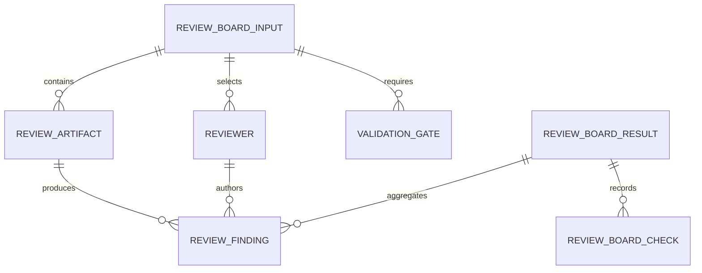
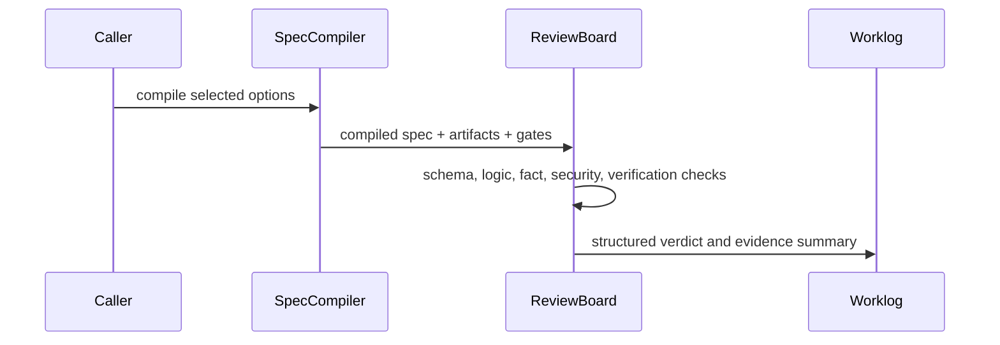

# T013 - Review / Critique / Verify Board

## 1. Task summary
Implement a deterministic shared Review Board contract for Agent Workbench. The board should take compiled specs and review artifacts, run reviewer perspectives against required validation gates, and return structured findings, gate checks, and an overall pass/warn/fail verdict without calling real LLMs or external APIs.

## 2. Repo context discovered
- T013 ticket is present but stubbed; it points to the master Agent Workbench plan.
- T012 introduced `compileWorkbenchSpec()`, `CompiledWorkbenchSpecSchema`, export formats, and memory artifact persistence.
- `ProductModeRegistry` already has `review`, `verify`, and `board` modes with default validation gates and reviewer-like agent roles.
- `OptionGraph` already has review-report and validation options that add review artifacts and gates.
- `default-workspace-bundle.ts` already defines `review-board-pack` as the skill surface for structured critique.
- No `mise.toml` / `.mise.toml` exists, so existing `bun` package scripts are the project interface for this task.

Schema view:



Sequence view:



Options compared:
- Shared pure engine first: smallest deterministic TDD surface, reusable by UI and T014 validation engine.
- UI board first: more visible, but risks duplicating contract logic and testing only rendering.
- Validation gate runner first: belongs more naturally to T014 and would overreach T013.

Recommended path: shared pure engine first, with schema and fixture tests. UI integration can consume the same contract later.

## 3. Files inspected
- `docs/tickets/T013-review-board.md`
- `docs/tickets/T014-validation-gates-engine.md`
- `docs/worklog/T012-spec-compiler-export.md`
- `packages/shared/src/workbench/spec-compiler.ts`
- `packages/shared/src/workbench/product-mode-registry.ts`
- `packages/shared/src/workbench/option-graph.ts`
- `packages/shared/src/workbench/default-workspace-bundle.ts`
- `packages/shared/src/workbench/index.ts`
- `packages/shared/package.json`
- `package.json`

## 4. Tests added first
Added `packages/shared/src/workbench/__tests__/review-board.test.ts` before production implementation.

Covered:
- Deriving reviewers, gates, and artifacts from a compiled `board` spec.
- Critical security findings fail the board.
- Missing fact-check source evidence warns the board.
- Clean sourced artifact plus validation evidence passes.

## 5. Expected failing test output
Initial targeted run failed for the expected missing implementation reason:

```text
error: Cannot find module '../review-board'
0 pass
1 fail
1 error
```

## 6. Implementation changes
Added `packages/shared/src/workbench/review-board.ts` with:
- Zod schemas for board inputs, artifacts, reviewers, evidence, checks, findings, and results.
- `createReviewBoardInputFromCompiledSpec()` to derive board title, required gates, and reviewer roster from compiled workbench specs.
- `runReviewBoard()` to produce deterministic pass/warn/fail results without real LLM or external API calls.
- Security review heuristic for secret-like artifact content.
- Fact-check heuristic for comparative claims without source artifacts.
- Evidence-required handling for RBAC, quota, sync, and test gates.
- Caller-roster reviewer resolution so findings reference reviewer IDs present in the board input.

Exports added:
- `packages/shared/src/workbench/index.ts`
- `packages/shared/package.json` subpath export `./workbench/review-board`

## 7. Validation commands run
```text
bun test packages/shared/src/workbench/__tests__/review-board.test.ts
bun test packages/shared/src/workbench/__tests__/review-board.test.ts packages/shared/src/workbench/__tests__/spec-compiler.test.ts packages/shared/src/workbench/__tests__/option-graph.test.ts packages/shared/src/workbench/__tests__/product-mode-registry.test.ts
bun run typecheck:shared
bun run typecheck:electron
bun run validate:docs
git diff --check
bun run electron:build
```

## 8. Passing test output summary
```text
review-board.test.ts: 5 pass, 0 fail, 15 expect() calls
workbench regression pack: 21 pass, 0 fail, 1 snapshot, 191 expect() calls
```

`typecheck:shared`, `typecheck:electron`, `validate:docs`, and `git diff --check` passed.

## 9. Build output summary
`bun run electron:build` passed before the review fixes:
- main process build verified
- preload builds verified
- renderer production build completed
- resources/assets copied

Final post-review `bun run electron:build` passed:
- main process build verified
- preload builds verified
- renderer production build completed in 23.60s
- resources/assets copied

Existing Vite chunk-size and Jotai deprecation warnings remain present and are not introduced by T013.

## 10. Remaining risks
- Master plan details for T013 are absent from the repo; implementation is scoped to the narrow shared contract implied by T006-T012.
- UI wiring is intentionally deferred unless later evidence shows T013 requires a rendered board screen.
- Review heuristics are intentionally deterministic and conservative; richer reviewer scoring belongs behind fake-provider integration tests in later workflow tasks.

## 11. Acceptance criteria matrix
| Criterion | Status | Evidence |
| --- | --- | --- |
| Review Board schema exists | PASS | `ReviewBoardInputSchema`, `ReviewBoardResultSchema`, and related schemas added |
| Board can be built from compiled spec | PASS | `createReviewBoardInputFromCompiledSpec()` test passes |
| Deterministic reviewers and validation checks exist | PASS | `runReviewBoard()` tests pass |
| Critical security issue fails the board | PASS | Protected secret-like artifact test returns `fail` |
| Missing evidence warns/fails relevant checks | PASS | Fact-check source gap warns; RBAC evidence gap fails |
| Clean artifact can pass | PASS | Sourced clean artifact with unit/RBAC evidence returns `pass` |
| Shared package export exists | PASS | Workbench barrel and package subpath export added |
| Targeted tests pass | PASS | `review-board.test.ts`: 5 pass |
| Relevant typecheck/build validation passes | PASS | Shared/electron typecheck, docs validation, diff check, and Electron build passed |
