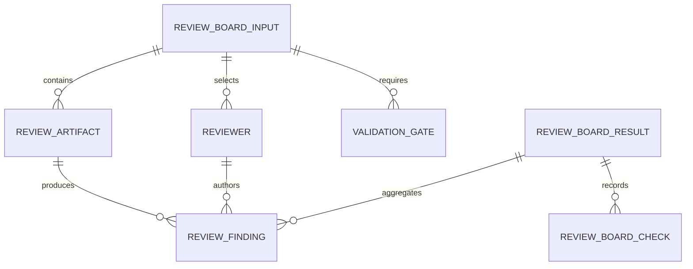
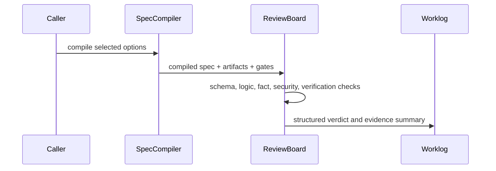

# T013 - Review / Critique / Verify Board

## 1. Task summary
Implement a deterministic shared Review Board contract for Agent Workbench. The board should take compiled specs and review artifacts, run reviewer perspectives against required validation gates, and return structured findings, gate checks, and an overall pass/warn/fail verdict without calling real LLMs or external APIs.

2026-05-05 integration update: close the narrow T014 -> T013 product workflow gap. The board now consumes failed structured validation evidence records and turns them into Review Gate findings with severity, evidence, and fix plan fields that the renderer shows in the user-visible Review Gate flow.

## 2. Repo context discovered
- T013 ticket is present but stubbed; it points to the master Agent Workbench plan.
- T012 introduced `compileWorkbenchSpec()`, `CompiledWorkbenchSpecSchema`, export formats, and memory artifact persistence.
- `ProductModeRegistry` already has `review`, `verify`, and `board` modes with default validation gates and reviewer-like agent roles.
- `OptionGraph` already has review-report and validation options that add review artifacts and gates.
- `default-workspace-bundle.ts` already defines `review-board-pack` as the skill surface for structured critique.
- No `mise.toml` / `.mise.toml` exists, so existing `bun` package scripts are the project interface for this task.
- `runValidationGates()` already handled missing and failed evidence, but the previous check result collapsed evidence records to a string and did not expose failed-record metadata to Review Board.
- `runReviewBoard()` already called `runValidationGates()` for missing evidence, but failed validation evidence records were not converted into review findings.
- `ReviewGateScreen` already rendered findings, but the fix plan was not a named user-visible field.

Schema view:



Sequence view:



Options compared:
- Shared pure engine first: smallest deterministic TDD surface, reusable by UI and T014 validation engine.
- UI board first: more visible, but risks duplicating contract logic and testing only rendering.
- Validation gate runner first: belongs more naturally to T014 and would overreach T013.

Recommended path: shared pure engine first, with schema and fixture tests. UI integration can consume the same contract later.

## 3. Files inspected
- `docs/tickets/T013-review-board.md`
- `docs/tickets/T014-validation-gates-engine.md`
- `docs/worklog/T012-spec-compiler-export.md`
- `packages/shared/src/workbench/spec-compiler.ts`
- `packages/shared/src/workbench/product-mode-registry.ts`
- `packages/shared/src/workbench/option-graph.ts`
- `packages/shared/src/workbench/default-workspace-bundle.ts`
- `packages/shared/src/workbench/index.ts`
- `packages/shared/package.json`
- `packages/shared/src/workbench/validation-gates.ts`
- `packages/shared/src/workbench/__tests__/validation-gates.test.ts`
- `packages/shared/src/workbench/__tests__/review-board.test.ts`
- `apps/electron/src/renderer/components/workbench/artifact-screen-state.ts`
- `apps/electron/src/renderer/components/workbench/ReviewGateScreen.tsx`
- `apps/electron/src/renderer/components/workbench/__tests__/artifact-screens.test.tsx`
- `package.json`

## 4. Tests added first
Added `packages/shared/src/workbench/__tests__/review-board.test.ts` before production implementation.

Covered:
- Deriving reviewers, gates, and artifacts from a compiled `board` spec.
- Critical security findings fail the board.
- Missing fact-check source evidence warns the board.
- Clean sourced artifact plus validation evidence passes.

2026-05-05 integration tests added first:
- Shared Review Board test: failed validation evidence records become structured Review Gate findings.
- Shared Validation Gates test: failed evidence records are preserved on gate checks for Review Gate consumers.
- Renderer Review Gate test: the component renders validation evidence findings with labeled severity, evidence, and fix plan.

## 5. Expected failing test output
Initial targeted run failed for the expected missing implementation reason:

```text
error: Cannot find module '../review-board'
0 pass
1 fail
1 error
```

2026-05-05 integration red output summary:

```text
review-board.test.ts:
Expected result.verdict to be "fail"; received "pass".

validation-gates.test.ts:
Expected ui_tests check to include severity "critical" and evidenceRecords; received severity "high" with no evidenceRecords.

artifact-screens.test.tsx:
Expected finding "Review Gate hides validation evidence" with critical severity and fixPlan; received generic "Required validation evidence is missing".
```

## 6. Implementation changes
Added `packages/shared/src/workbench/review-board.ts` with:
- Zod schemas for board inputs, artifacts, reviewers, evidence, checks, findings, and results.
- `createReviewBoardInputFromCompiledSpec()` to derive board title, required gates, and reviewer roster from compiled workbench specs.
- `runReviewBoard()` to produce deterministic pass/warn/fail results without real LLM or external API calls.
- Security review heuristic for secret-like artifact content.
- Fact-check heuristic for comparative claims without source artifacts.
- Evidence-required handling for RBAC, quota, sync, and test gates.
- Caller-roster reviewer resolution so findings reference reviewer IDs present in the board input.

2026-05-05 integration changes:
- Reused `ValidationGateEvidenceSchema` as the Review Board evidence contract.
- Added `fixPlan` to `ReviewFindingSchema` while preserving `recommendation` for compatibility.
- Converted failed validation evidence records into findings using record severity, title, evidence summary, artifact refs, and fix plan.
- Passed caller-supplied evidence through `createReviewGateState()`.
- Rendered finding severity, gates, evidence, and fix plan as labeled fields in `ReviewGateScreen`.

Exports added:
- `packages/shared/src/workbench/index.ts`
- `packages/shared/package.json` subpath export `./workbench/review-board`

## 7. Validation commands run
```text
bun test packages/shared/src/workbench/__tests__/review-board.test.ts
bun test packages/shared/src/workbench/__tests__/review-board.test.ts packages/shared/src/workbench/__tests__/spec-compiler.test.ts packages/shared/src/workbench/__tests__/option-graph.test.ts packages/shared/src/workbench/__tests__/product-mode-registry.test.ts
bun run typecheck:shared
bun run typecheck:electron
bun run validate:docs
git diff --check
bun run electron:build
```

2026-05-05 integration validation commands:

```text
bun test packages/shared/src/workbench/__tests__/validation-gates.test.ts packages/shared/src/workbench/__tests__/review-board.test.ts
bun test apps/electron/src/renderer/components/workbench/__tests__/artifact-screens.test.tsx
bun test packages/shared/src/workbench/__tests__/validation-gates.test.ts packages/shared/src/workbench/__tests__/review-board.test.ts packages/shared/src/workbench/__tests__/spec-compiler.test.ts packages/shared/src/workbench/__tests__/option-graph.test.ts packages/shared/src/workbench/__tests__/product-mode-registry.test.ts
bun test apps/electron/src/renderer/components/workbench
bun run typecheck:shared
bun run typecheck:electron
bun run lint:shared
bun run lint:electron
bun run electron:build
bun run validate:docs
git diff --check -- packages/shared/src/workbench apps/electron/src/renderer/components/workbench docs/worklog/T013-review-board.md docs/worklog/T014-validation-gates-engine.md docs/tickets/T013-review-board.md docs/tickets/T014-validation-gates-engine.md
```

## 8. Passing test output summary
```text
review-board.test.ts: 5 pass, 0 fail, 15 expect() calls
workbench regression pack: 21 pass, 0 fail, 1 snapshot, 191 expect() calls
```

`typecheck:shared`, `typecheck:electron`, `validate:docs`, and `git diff --check` passed.

2026-05-05 integration passing output summary:

```text
validation-gates + review-board: 13 pass, 0 fail, 35 expect() calls
artifact-screens.test.tsx: 5 pass, 0 fail, 35 expect() calls
shared workbench pack: 29 pass, 0 fail, 1 snapshot, 211 expect() calls
renderer workbench pack: 57 pass, 0 fail, 282 expect() calls
```

`typecheck:shared`, `typecheck:electron`, `lint:shared`, `lint:electron`, `validate:docs`, and `git diff --check` passed.

## 9. Build output summary
`bun run electron:build` passed before the review fixes:
- main process build verified
- preload builds verified
- renderer production build completed
- resources/assets copied

Final post-review `bun run electron:build` passed:
- main process build verified
- preload builds verified
- renderer production build completed in 23.60s
- resources/assets copied

Existing Vite chunk-size and Jotai deprecation warnings remain present and are not introduced by T013.

2026-05-05 integration build summary:
- `bun run electron:build` passed.
- Renderer production build completed in 22.86s.
- Existing warnings remain: Vite outDir notice, Jotai Babel deprecation notices, and chunk-size warnings.

## 10. Remaining risks
- Master plan details for T013 are absent from the repo; implementation is scoped to the narrow shared contract implied by T006-T012.
- User-visible Review Gate rendering is covered through the existing workbench artifact component flow, not by editing AppShell or composer files outside Worker C scope.
- Review heuristics are intentionally deterministic and conservative; richer reviewer scoring belongs behind fake-provider integration tests in later workflow tasks.
- No live browser/click smoke was run; renderer coverage uses deterministic static React rendering.

## 11. Acceptance criteria matrix
| Criterion | Status | Evidence |
| --- | --- | --- |
| Review Board schema exists | PASS | `ReviewBoardInputSchema`, `ReviewBoardResultSchema`, and related schemas added |
| Board can be built from compiled spec | PASS | `createReviewBoardInputFromCompiledSpec()` test passes |
| Deterministic reviewers and validation checks exist | PASS | `runReviewBoard()` tests pass |
| Critical security issue fails the board | PASS | Protected secret-like artifact test returns `fail` |
| Missing evidence warns/fails relevant checks | PASS | Fact-check source gap warns; RBAC evidence gap fails |
| Clean artifact can pass | PASS | Sourced clean artifact with unit/RBAC evidence returns `pass` |
| Shared package export exists | PASS | Workbench barrel and package subpath export added |
| Targeted tests pass | PASS | 2026-05-05 integration targets: validation-gates + review-board 13 pass; artifact-screens 5 pass |
| Relevant typecheck/build validation passes | PASS | Shared/electron typecheck, shared/electron lint, docs validation, diff check, and Electron build passed |
| Failed validation evidence becomes Review Board findings | PASS | `review-board.test.ts` covers critical failed `ui_tests` evidence record -> structured finding |
| Review Gate renders structured finding fields | PASS | `artifact-screens.test.tsx` verifies labeled Severity, Evidence, and Fix plan output |
| No real LLM/API calls | PASS | Pure shared/renderer tests pass with caller-supplied evidence records only |
