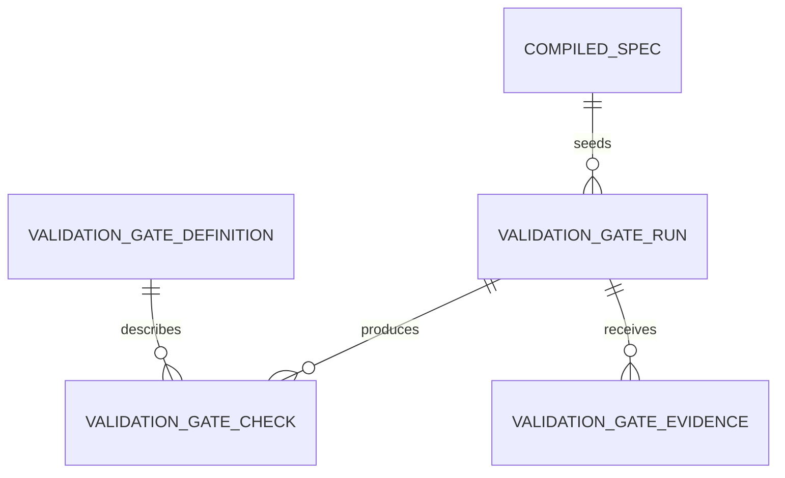
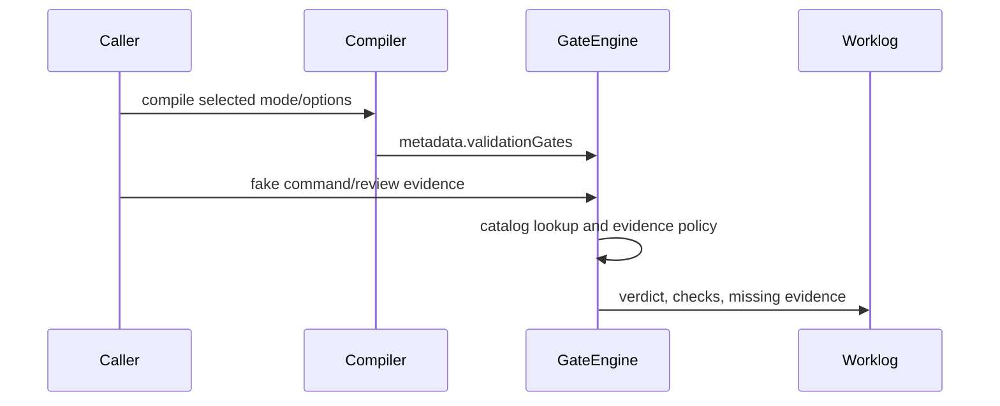

# T014 - Validation Gates engine

## 1. Task summary
Implement a deterministic shared Validation Gates engine for Agent Workbench. It should turn product-mode/spec validation gates into an auditable catalog and pure run result, enforce evidence for blocking gates, and avoid real LLM, browser, S3, billing, or cloud calls in tests.

2026-05-05 integration update: close the T014 -> T013 gap by preserving structured validation evidence records on gate checks so Review Board and Review Gate can consume severity, evidence, artifact refs, and fix plans.

## 2. Repo context discovered
- T014 ticket is present but stubbed and points back to the master backlog.
- T006 introduced `ValidationGateSchema` and default gates in `product-mode-registry.ts`.
- T010/T012 route option and compiler choices into `metadata.validationGates` and `spec.validationPlan`.
- T013 added `review-board.ts`, but evidence-required gate semantics are local to the board.
- UI currently displays validation gates in the spec builder, but does not execute them.
- No `mise.toml` / `.mise.toml` exists, so existing `bun` package scripts are the project interface for this task.
- Existing `ValidationGateEvidenceSchema` accepted command summaries and pass/fail, but failed evidence metadata was collapsed before downstream Review Gate consumers could render it.
- `ReviewBoardEvidenceSchema` duplicated a narrower evidence shape, so Review Board could not consume the full validation evidence record contract.

Assumptions and boundaries:
- The T014 engine is a pure shared module, not a UI screen and not an external command runner.
- Evidence is supplied by callers/tests as structured fake command results; the engine never shells out.
- Review Board may consume the same gate catalog later or in this task to avoid duplicated policy.

Schema view:



Sequence view:



Options compared:
- New `validation-gates` shared module: clearest T014 boundary, reusable by Review Board and UI.
- Expand `review-board.ts` only: smaller diff, but keeps validation policy coupled to one consumer.
- UI execution first: visible, but overreaches the current pure shared backlog layer.

Recommended path: add a small pure shared gate engine, tests first, then optionally refactor Review Board onto the shared policy if it stays low-risk.

## 3. Files inspected
- `docs/tickets/T014-validation-gates-engine.md`
- `docs/worklog/T013-review-board.md`
- `packages/shared/src/workbench/product-mode-registry.ts`
- `packages/shared/src/workbench/option-graph.ts`
- `packages/shared/src/workbench/spec-compiler.ts`
- `packages/shared/src/workbench/review-board.ts`
- `packages/shared/src/workbench/index.ts`
- `packages/shared/package.json`
- `apps/electron/src/renderer/components/workbench/spec-builder-state.ts`
- `apps/electron/src/renderer/components/workbench/SpecBuilderScreen.tsx`
- `packages/shared/src/workbench/__tests__/validation-gates.test.ts`
- `packages/shared/src/workbench/__tests__/review-board.test.ts`
- `apps/electron/src/renderer/components/workbench/artifact-screen-state.ts`
- `apps/electron/src/renderer/components/workbench/ReviewGateScreen.tsx`
- `apps/electron/src/renderer/components/workbench/__tests__/artifact-screens.test.tsx`

## 4. Tests added first
Added `packages/shared/src/workbench/__tests__/validation-gates.test.ts` before production implementation.

Covered:
- Catalog has one definition for every `ValidationGateSchema` option.
- Test/RBAC/quota/sync gates require blocking evidence.
- Non-evidence gates pass without command evidence.
- Missing RBAC/quota/sync evidence fails.
- Explicit failed command evidence fails.
- Compiled specs can seed a validation run without external providers.

2026-05-05 integration tests added first:
- `validation-gates.test.ts` asserts failed evidence records are preserved on checks for Review Gate consumers.
- `review-board.test.ts` asserts Review Board turns a failed validation record into a structured finding.
- `artifact-screens.test.tsx` asserts Review Gate renders labeled severity, evidence, and fix plan fields.

## 5. Expected failing test output
Initial targeted run failed for the expected missing implementation reason:

```text
error: Cannot find module '../validation-gates'
0 pass
1 fail
1 error
```

2026-05-05 integration red output summary:

```text
validation-gates.test.ts:
Expected failed ui_tests check to include evidenceRecords and critical severity; received only string evidence and high severity.

review-board.test.ts:
Expected failed validation evidence to fail the board; received pass.

artifact-screens.test.tsx:
Expected Review Gate finding from supplied evidence record; received missing-evidence fallback.
```

## 6. Implementation changes
Added `packages/shared/src/workbench/validation-gates.ts` with:
- Zod schemas for gate definitions, evidence, checks, run input, and run results.
- A catalog covering every `ValidationGateSchema` option.
- Evidence-required blocking policy for unit, integration, UI, E2E, RBAC, quota, and sync gates.
- `runValidationGates()` to produce deterministic pass/warn/fail results without executing commands.
- `createValidationGateRunFromCompiledSpec()` to seed runs from compiled spec metadata.
- Public exports through the workbench barrel and package subpath.

Refactored `review-board.ts` missing-evidence findings to consume the shared validation gate runner instead of maintaining a separate evidence-required set.

2026-05-05 integration changes:
- Extended `ValidationGateEvidenceSchema` with optional `evidenceId`, `severity`, `findingTitle`, and `fixPlan`.
- Added `evidenceRecords` to `ValidationGateCheckSchema`.
- Failed evidence severity now escalates the gate check severity.
- Exported `ParsedValidationGateEvidence` for structured consumers.
- Reused the validation evidence schema from Review Board instead of a narrower duplicate schema.

## 7. Validation commands run
```text
bun test packages/shared/src/workbench/__tests__/validation-gates.test.ts
bun test packages/shared/src/workbench/__tests__/validation-gates.test.ts packages/shared/src/workbench/__tests__/review-board.test.ts
bun test packages/shared/src/workbench/__tests__/validation-gates.test.ts packages/shared/src/workbench/__tests__/review-board.test.ts packages/shared/src/workbench/__tests__/spec-compiler.test.ts packages/shared/src/workbench/__tests__/option-graph.test.ts packages/shared/src/workbench/__tests__/product-mode-registry.test.ts
bun run typecheck:shared
bun run typecheck:electron
bun run validate:docs
git diff --check
bun run electron:build
```

2026-05-05 integration validation commands:

```text
bun test packages/shared/src/workbench/__tests__/validation-gates.test.ts packages/shared/src/workbench/__tests__/review-board.test.ts
bun test apps/electron/src/renderer/components/workbench/__tests__/artifact-screens.test.tsx
bun test packages/shared/src/workbench/__tests__/validation-gates.test.ts packages/shared/src/workbench/__tests__/review-board.test.ts packages/shared/src/workbench/__tests__/spec-compiler.test.ts packages/shared/src/workbench/__tests__/option-graph.test.ts packages/shared/src/workbench/__tests__/product-mode-registry.test.ts
bun test apps/electron/src/renderer/components/workbench
bun run typecheck:shared
bun run typecheck:electron
bun run lint:shared
bun run lint:electron
bun run electron:build
bun run validate:docs
git diff --check -- packages/shared/src/workbench apps/electron/src/renderer/components/workbench docs/worklog/T013-review-board.md docs/worklog/T014-validation-gates-engine.md docs/tickets/T013-review-board.md docs/tickets/T014-validation-gates-engine.md
```

## 8. Passing test output summary
```text
validation-gates.test.ts: 6 pass, 0 fail, 15 expect() calls
validation-gates + review-board regression: 11 pass, 0 fail, 30 expect() calls
workbench regression pack: 27 pass, 0 fail, 1 snapshot, 206 expect() calls
```

`typecheck:shared`, `typecheck:electron`, `validate:docs`, and `git diff --check` passed.

2026-05-05 integration passing output summary:

```text
validation-gates + review-board: 13 pass, 0 fail, 35 expect() calls
artifact-screens.test.tsx: 5 pass, 0 fail, 35 expect() calls
shared workbench pack: 29 pass, 0 fail, 1 snapshot, 211 expect() calls
renderer workbench pack: 57 pass, 0 fail, 282 expect() calls
```

`typecheck:shared`, `typecheck:electron`, `lint:shared`, `lint:electron`, `validate:docs`, and `git diff --check` passed.

## 9. Build output summary
`bun run electron:build` passed:
- main process build verified
- preload builds verified
- renderer production build completed in 24.04s
- resources/assets copied

Existing Vite chunk-size and Jotai deprecation warnings remain present and are not introduced by T014.

2026-05-05 integration build summary:
- `bun run electron:build` passed.
- Renderer production build completed in 22.86s.
- Existing warnings remain: Vite outDir notice, Jotai Babel deprecation notices, and chunk-size warnings.

## 10. Remaining risks
- Master plan details for T014 are absent from the repo; implementation is scoped to the deterministic shared contract implied by T006-T013.
- UI display is now covered through Review Gate, but AppShell/composer wiring outside Worker C scope was not changed.
- The engine records caller-supplied evidence and verdicts; it intentionally does not execute shell commands itself.
- No live browser/click smoke was run; renderer validation uses deterministic static React rendering.

## 11. Acceptance criteria matrix
| Criterion | Status | Evidence |
| --- | --- | --- |
| Gate catalog covers every known gate | PASS | `validation-gates.test.ts` checks every `ValidationGateSchema` option |
| Evidence-required gates are explicit | PASS | Test/RBAC/quota/sync evidence policy test passes |
| Missing protected evidence fails | PASS | Missing RBAC/quota/sync evidence test returns `fail` |
| Failed evidence fails | PASS | Explicit failed command evidence test returns `fail` |
| Compiled spec can seed a run | PASS | `createValidationGateRunFromCompiledSpec()` test passes |
| Shared package export exists | PASS | Workbench barrel and package subpath export added |
| Targeted tests pass | PASS | 2026-05-05 integration targets: validation-gates + review-board 13 pass; artifact-screens 5 pass |
| Relevant typecheck/build validation passes | PASS | Shared/electron typecheck, shared/electron lint, docs validation, diff check, and Electron build passed |
| Failed evidence records are preserved | PASS | `validation-gates.test.ts` asserts `evidenceRecords` carries failed record metadata |
| Failed evidence severity can escalate checks | PASS | `ui_tests` failed evidence record returns `critical` severity |
| Review Board can consume validation evidence | PASS | `review-board.test.ts` consumes shared evidence records and emits structured findings |
