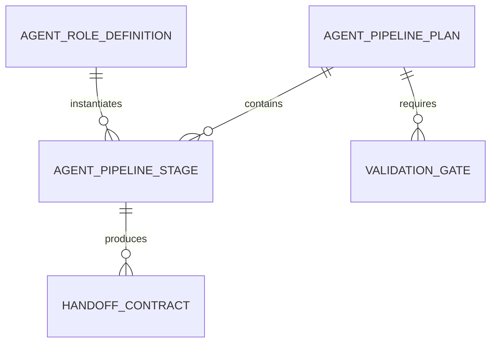
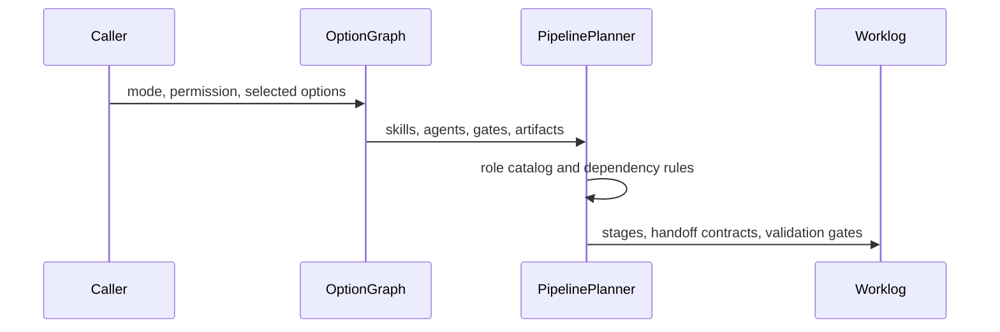

# T015 - Multi-agent role registry and pipeline planner

## 1. Task summary
Implement a deterministic shared role registry and pipeline planner for Agent Workbench. It should derive role stages, dependencies, skills, handoff contracts, and validation gates from the existing product mode and option graph vocabulary without launching real agents.

## 2. Repo context discovered
- T015 ticket is present but stubbed and points back to the master backlog.
- T006 introduced `ProductAgentRoleSchema` and default role lists in `product-mode-registry.ts`.
- T010 option graph can add roles through `addsAgents`.
- T012 compiled specs persist derived `source.agents`, but there is no role/stage planner yet.
- `multi-agent-planning-pack` already describes role-based pipelines and handoff contracts.
- Spec Builder UI displays derived agents but does not execute a pipeline.
- No `mise.toml` / `.mise.toml` exists, so existing `bun` package scripts are the project interface for this task.

Assumptions and boundaries:
- The T015 planner is a pure shared module, not a runtime launcher and not OMX orchestration.
- Dependencies are deterministic and derived from role lanes plus selected TDD/security/review semantics.
- Handoff contracts are typed metadata for later runtime/UI integration; no real agent process is started.

Schema view:



Sequence view:



Options compared:
- New shared planner module: clean T015 boundary and reusable by UI/runtime.
- Extend `product-mode-registry.ts`: smaller file count, but mixes static mode config with executable stage planning.
- UI preview first: visible but would duplicate planning rules outside shared tests.

Recommended path: add a pure `agent-pipeline-planner` module with schema tests and fixture-like build/research/review cases.

## 3. Files inspected
- `docs/tickets/T015-multi-agent-pipeline-planner.md`
- `docs/worklog/T006-product-mode-registry.md`
- `docs/worklog/T010-option-graph-schema.md`
- `docs/worklog/T012-spec-compiler-export.md`
- `packages/shared/src/workbench/product-mode-registry.ts`
- `packages/shared/src/workbench/option-graph.ts`
- `packages/shared/src/workbench/spec-compiler.ts`
- `packages/shared/src/workbench/default-workspace-bundle.ts`
- `apps/electron/src/renderer/components/workbench/spec-builder-state.ts`
- `apps/electron/src/renderer/components/workbench/SpecBuilderScreen.tsx`

## 4. Tests added first
Added `packages/shared/src/workbench/__tests__/agent-pipeline-planner.test.ts` before production implementation.

Covered:
- Role catalog has one definition for every `ProductAgentRoleSchema` option.
- TDD build plans put `test-agent` before `builder-agent`.
- Verification runs after critique in build/review flows.
- Research mode keeps research, verifier, and synthesizer lanes deterministic.
- Selected agents are deduplicated while preserving role-order dependencies.

## 5. Expected failing test output
Initial targeted run failed for the expected missing implementation reason:

```text
error: Cannot find module '../agent-pipeline-planner'
0 pass
1 fail
1 error
```

## 6. Implementation changes
Added `packages/shared/src/workbench/agent-pipeline-planner.ts` with:
- Zod schemas for role definitions, pipeline stages, handoff contracts, inputs, and plans.
- A role catalog covering every `ProductAgentRoleSchema` option.
- `planAgentPipeline()` to derive stages from mode defaults, option graph additions, and selected agent overrides.
- Deterministic role ordering that places test-first lanes before implementation and verification after critique.
- Required handoff contracts between dependent stages with artifact types and validation gates.
- Public exports through the workbench barrel and package subpath.

## 7. Validation commands run
```text
bun test packages/shared/src/workbench/__tests__/agent-pipeline-planner.test.ts
bun test packages/shared/src/workbench/__tests__/agent-pipeline-planner.test.ts packages/shared/src/workbench/__tests__/validation-gates.test.ts packages/shared/src/workbench/__tests__/review-board.test.ts packages/shared/src/workbench/__tests__/spec-compiler.test.ts packages/shared/src/workbench/__tests__/option-graph.test.ts packages/shared/src/workbench/__tests__/product-mode-registry.test.ts
bun run typecheck:shared
bun run typecheck:electron
bun run validate:docs
git diff --check
bun run electron:build
```

## 8. Passing test output summary
```text
agent-pipeline-planner.test.ts: 4 pass, 0 fail, 17 expect() calls
workbench regression pack: 31 pass, 0 fail, 1 snapshot, 223 expect() calls
```

`typecheck:shared`, `typecheck:electron`, `validate:docs`, and `git diff --check` passed.

## 9. Build output summary
`bun run electron:build` passed:
- main process build verified
- preload builds verified
- renderer production build completed in 25.96s
- resources/assets copied

Existing Vite chunk-size and Jotai deprecation warnings remain present and are not introduced by T015.

## 10. Remaining risks
- Master plan details for T015 are absent from the repo; implementation is scoped to the deterministic shared planner implied by T006-T014.
- Runtime execution and UI pipeline visualization are deferred.
- The planner emits metadata and dependencies only; it intentionally does not launch agents or mutate runtime state.

## 11. Acceptance criteria matrix
| Criterion | Status | Evidence |
| --- | --- | --- |
| Role catalog covers every product agent role | PASS | `agent-pipeline-planner.test.ts` checks every `ProductAgentRoleSchema` option |
| Pipeline derives roles from mode/options | PASS | Build/research/review planner tests pass |
| TDD test-first ordering exists | PASS | Build TDD test asserts `test-agent` before `builder-agent` |
| Handoff contracts exist | PASS | Build TDD test asserts test-to-builder handoff contract |
| Review/research dependencies are deterministic | PASS | Research/review ordering and dependency tests pass |
| Shared package export exists | PASS | Workbench barrel and package subpath export added |
| Targeted tests pass | PASS | `agent-pipeline-planner.test.ts`: 4 pass |
| Relevant typecheck/build validation passes | PASS | Shared/electron typecheck, docs validation, diff check, and Electron build passed |

## 12. Worker D integration closure - 2026-05-05

### Task summary
Closed the remaining T015 integration gap: the planner is now consumed by the user-visible Spec Builder launcher path, not only by shared model tests.

### Repo context discovered
- `planAgentPipeline()` already produced deterministic stages and handoff contracts.
- `SpecBuilderScreen` exposed a `Start Agent Plan` action, but the state passed to that callback did not include a launcher-ready plan.
- `SpecBuilderScreen` displayed derived agents, skills, gates, and artifacts, but did not show a pipeline preview that could prove execution order.
- No `mise.toml` / `.mise.toml` exists; existing `bun` scripts are the project interface.

### Files inspected
- `packages/shared/src/workbench/agent-pipeline-planner.ts`
- `packages/shared/src/workbench/__tests__/agent-pipeline-planner.test.ts`
- `packages/shared/src/workbench/option-graph.ts`
- `packages/shared/src/workbench/product-mode-registry.ts`
- `apps/electron/src/renderer/components/workbench/spec-builder-state.ts`
- `apps/electron/src/renderer/components/workbench/SpecBuilderScreen.tsx`
- `apps/electron/src/renderer/components/workbench/__tests__/spec-builder-screen.test.tsx`
- `docs/tickets/T015-multi-agent-pipeline-planner.md`
- `docs/worklog/T015-multi-agent-pipeline-planner.md`

### Tests added first
Extended `apps/electron/src/renderer/components/workbench/__tests__/spec-builder-screen.test.tsx` with a red integration test:
- selects build/TDD/security/strict-gate workflow options;
- expects `createSpecBuilderState()` to expose `canStartAgentPlan`;
- expects `state.agentPlan` to contain planner, test, builder, critic, verifier stages;
- expects test-to-builder handoff contract;
- expects the rendered screen to show `Pipeline preview`, `test-agent`, and `builder-agent`.

### Expected failing test output
Initial targeted red run failed for the expected consumer-gap reason:

```text
Expected: true
Received: undefined
at spec-builder-screen.test.tsx:117
5 pass
1 fail
```

### Implementation changes
- Added `agentPlan` and `canStartAgentPlan` to `SpecBuilderState`.
- Wired `createSpecBuilderState()` to call `planAgentPipeline()` with the same mode, input, permission mode, and selected option IDs already used by derived config.
- Added a deterministic Spec Builder plan ID derived from mode + selected options.
- Added a `Pipeline preview` section to `SpecBuilderScreen`, rendering ordered stages and dependencies.
- Extended preview markdown with an `Agent pipeline` section when a plan exists.

### Validation commands run
```text
bun test apps/electron/src/renderer/components/workbench/__tests__/spec-builder-screen.test.tsx
bun test packages/shared/src/workbench/__tests__/agent-pipeline-planner.test.ts packages/shared/src/automations/automation-presets.test.ts apps/electron/src/renderer/components/workbench/__tests__/spec-builder-screen.test.tsx
bun run typecheck:shared
bun run typecheck:electron
bun run lint:shared
bun run lint:electron
bun run validate:agent-contract
git diff --check
bun run electron:build
bun run electron:smoke
```

### Passing test output summary
```text
spec-builder-screen.test.tsx: 6 pass, 0 fail, 37 expect() calls
combined targeted pack: 15 pass, 0 fail, 70 expect() calls
```

`typecheck:shared`, `typecheck:electron`, `lint:shared`, `lint:electron`, `validate:agent-contract`, `git diff --check`, `electron:build`, and `electron:smoke` passed.

### Build output summary
Supervisor integration initially caught a renderer build failure after this worker slice because Spec Builder imported the broad `@craft-agent/shared/automations` barrel, which pulled `resolve-config-path.ts` and `node:crypto` into the browser bundle.

The fix added the browser-safe `@craft-agent/shared/automations/presets` package export and changed the renderer to import only that preset surface. `bun run electron:build` then completed successfully, and `bun run electron:smoke` reached `[smoke] Electron headless startup passed`.

### Remaining risks
- This is still a launch payload and preview, not a runtime multi-agent process executor.
- The parent orchestrator still needs to decide how to persist or dispatch `state.agentPlan` after `onStartAgentPlan`.

### Acceptance criteria matrix
| Criterion | Status | Evidence |
| --- | --- | --- |
| Planner is consumed outside model tests | PASS | `createSpecBuilderState()` now creates `agentPlan` |
| User-visible launcher path can inspect plan | PASS | `SpecBuilderScreen` renders `Pipeline preview` |
| TDD ordering is visible to launcher | PASS | Test asserts `test-agent` before `builder-agent` |
| Handoff contract is preserved | PASS | Test asserts `stage-002-test-agent` to `stage-003-builder-agent` handoff |
| Relevant targeted tests pass | PASS | Combined targeted pack: 15 pass |
| Relevant typecheck/lint passes | PASS | Shared/electron typecheck and lint passed |
