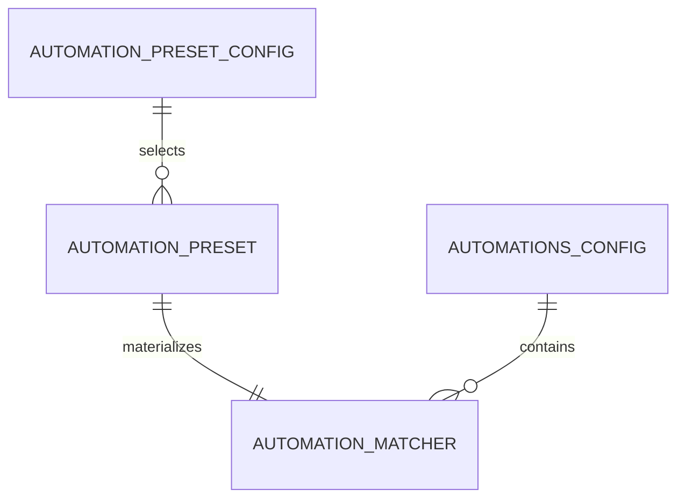
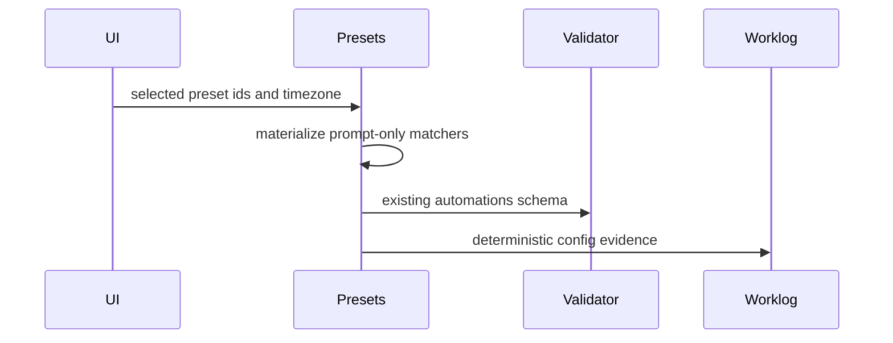

# T016 - Automation presets

## 1. Task summary
Implement safe Agent Workbench automation presets that can be materialized into the existing `automations.json` config shape. Presets should be deterministic, prompt-only, idempotent when applied repeatedly, and valid under the existing automation schema.

## 2. Repo context discovered
- T016 ticket is present but stubbed and points back to the master backlog.
- Existing automation config shape lives in `packages/shared/src/automations/types.ts`.
- Existing validation lives in `packages/shared/src/automations/schemas.ts` and `validation.ts`.
- `AutomationSystem` loads `automations.json`; this task should not write files or run triggers.
- Existing security guidance warns against direct config edits; a shared preset materializer gives later UI/CLI code a safe source of truth.
- No `mise.toml` / `.mise.toml` exists, so existing `bun` package scripts are the project interface for this task.

Assumptions and boundaries:
- Presets are prompt-only and do not include webhook URLs, shell commands, or secrets.
- Applying presets returns a new config object; no disk writes happen in this shared module.
- Manual trigger/runtime execution is deferred because current automation execution is handled by `AutomationSystem` and prompt handlers.

Schema view:



Sequence view:



Options compared:
- New shared preset module: safest boundary and reusable by UI/CLI.
- Edit `AutomationSystem`: overreaches into runtime execution and disk loading.
- Add static JSON templates: less type-safe and easy to drift from schema.

Recommended path: add a pure `presets.ts` module plus unit tests against existing automation validation.

## 3. Files inspected
- `docs/tickets/T016-automation-presets.md`
- `.agents/skills/automation-designer/SKILL.md`
- `packages/shared/src/automations/types.ts`
- `packages/shared/src/automations/schemas.ts`
- `packages/shared/src/automations/validation.ts`
- `packages/shared/src/automations/index.ts`
- `packages/shared/src/automations/automation-system.test.ts`
- `docs/worklog/T005-skill-bundle-installer.md`
- `docs/worklog/T008-prompt-rewrite-engine.md`

## 4. Tests added first
Added `packages/shared/src/automations/automation-presets.test.ts` before production implementation.

Covered:
- Catalog ships deterministic prompt-only presets with stable IDs.
- Presets materialize into existing matcher/config shape.
- Applying presets is idempotent and preserves existing automations.
- Generated config validates with existing automation validator.
- Unknown preset IDs are rejected before config production.

## 5. Expected failing test output
Initial targeted run failed for the expected missing implementation reason:

```text
error: Cannot find module './presets.ts'
0 pass
1 fail
1 error
```

## 6. Implementation changes
Added `packages/shared/src/automations/presets.ts` with:
- Stable preset IDs and a typed preset catalog.
- Prompt-only matcher definitions for daily review, blocked-session triage, and TDD failure follow-up.
- `materializeAutomationPreset()` for deterministic matcher generation with timezone/enabled overrides.
- `applyAutomationPresets()` for idempotent config merging that preserves existing automations.
- Public exports through the automations barrel.

## 7. Validation commands run
```text
bun test packages/shared/src/automations/automation-presets.test.ts
bun test packages/shared/src/automations/automation-presets.test.ts packages/shared/src/automations/automation-system.test.ts packages/shared/src/automations/resolve-config-path.test.ts
bun run typecheck:shared
bun run typecheck:electron
bun run validate:docs
git diff --check
bun run electron:build
```

## 8. Passing test output summary
```text
automation-presets.test.ts: 4 pass, 0 fail, 10 expect() calls
automation regression pack: 29 pass, 0 fail, 54 expect() calls
```

`typecheck:shared`, `typecheck:electron`, `validate:docs`, and `git diff --check` passed.

## 9. Build output summary
`bun run electron:build` passed:
- main process build verified
- preload builds verified
- renderer production build completed in 25.70s
- resources/assets copied

Existing Vite chunk-size and Jotai deprecation warnings remain present and are not introduced by T016.

## 10. Remaining risks
- Master plan details for T016 are absent from the repo; implementation is scoped to safe shared presets over the existing automation schema.
- Runtime/UI installation of presets is deferred to later integration work.

## 11. Acceptance criteria matrix
| Criterion | Status | Evidence |
| --- | --- | --- |
| Preset catalog exists | PASS | Catalog test checks stable IDs |
| Presets are prompt-only | PASS | Catalog test asserts every action is `prompt` |
| Presets materialize to valid automation config | PASS | Materializer test and existing validator pass |
| Applying presets is idempotent | PASS | Double-apply test returns identical config |
| Existing automations are preserved | PASS | Existing matcher remains before preset matchers |
| Unknown presets are rejected | PASS | Schema rejection test passes |
| Targeted tests pass | PASS | `automation-presets.test.ts`: 4 pass |
| Relevant typecheck/build validation passes | PASS | Shared/electron typecheck, docs validation, diff check, and Electron build passed |
