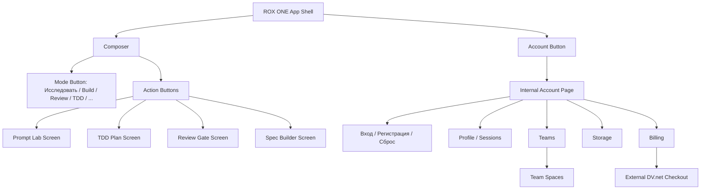
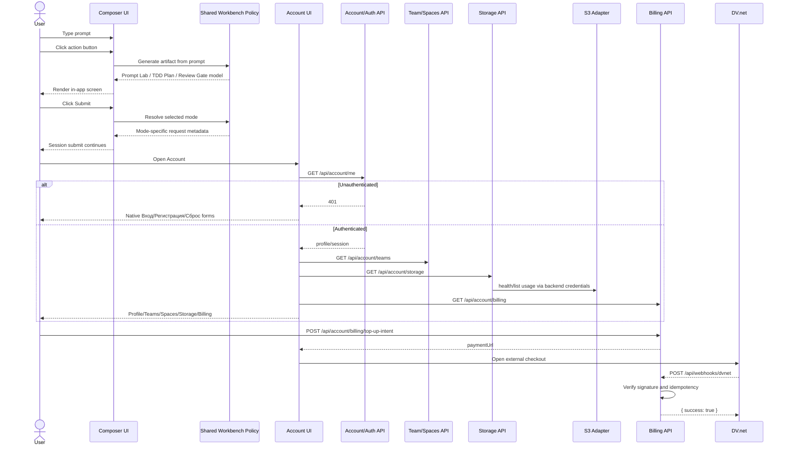
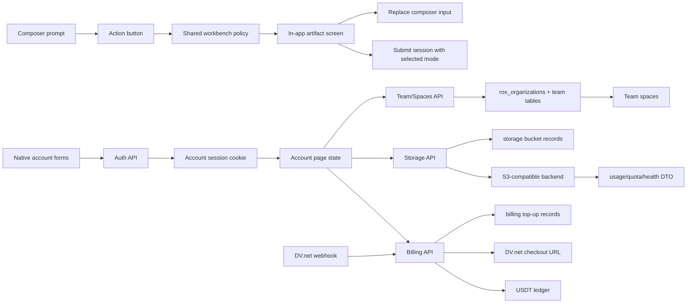

# T032 ROX Composer, Account, Teams, Billing/Storage UX Plan

## 1. Task summary

Design the in-app UX and implementation boundary for the next ROX ONE workbench layer:

- Composer mode selector remains the behavioral routing control near the current `Исследовать` affordance.
- Composer action buttons open focused in-app screens/sheets from the current prompt: `Улучшить prompt`, `TDD Plan`, `Проверить`, `Разъебать`, `Собрать ТЗ`, `Ревью`.
- Account, login, registration, teams, spaces, storage, and billing must live inside the ROX ONE UI instead of sending the user into an embedded browser account page.
- DV.net checkout may open externally only after the app creates a backend top-up intent.
- S3-compatible storage must stay backend-only, with user/team buckets and spaces as prefixes.

## 2. Reformulated task

The product should stop treating the top composer controls as a single cramped mode/action hybrid. The top control row should become two explicit concepts:

1. `Mode`: a compact segmented/pill selector that changes how the main submit behaves.
2. `Actions`: buttons that transform or analyze the current prompt and open a dedicated in-app screen with generated artifacts.

The account surface should become a first-class native app section:

1. Unauthenticated users see `Вход`, `Регистрация`, and `Сброс пароля` forms inside ROX ONE.
2. Authenticated users see profile, sessions, teams, spaces, storage, billing, and events inside ROX ONE.
3. Browser panes are not used for account navigation. Only DV.net payment checkout is allowed to leave the app UI.

## 3. Assumptions and boundaries

- No `mise.toml` exists; use existing `package.json` scripts.
- Current dirty files for T031 and auto-update work are not overwritten by this planning pass.
- `rox_organizations` remains the database compatibility layer, but product language becomes `Team`.
- `Team -> Spaces` is the collaboration model. An organization/team owns spaces; spaces own sessions, files, artifacts, and storage prefixes.
- Balance display currency is `USDT`.
- S3 credentials, DV.net secrets, webhook verification, and bucket creation remain server-side only.
- Renderer never receives S3 keys or DV.net signing secrets.
- `http://s3.max:9000` is the preferred backend endpoint; `http://s3.rox:9000` is fallback. UI only shows health/status returned by backend.
- DV.net official docs allow payment form links using `/pay/store/{store-uuid}/{client-id}` and require webhook idempotency by `tx_hash + bc_uniq_key`. Credit only confirmed `PaymentReceived`.

## 4. Repo context discovered

- `apps/electron/src/renderer/components/app-shell/input/ProductModeToolbar.tsx` currently renders a native `<select>` plus action buttons.
- `apps/electron/src/renderer/components/app-shell/input/product-mode-toolbar.ts` currently defaults to `rewrite` and already models mode/action intents.
- `apps/electron/src/renderer/components/app-shell/input/FreeFormInput.tsx` mounts `ProductModeToolbar`, `PromptRewriteDialog`, and `ThinkingPartnerRoundTableDialog` inside the composer.
- `packages/shared/src/workbench/prompt-rewrite-engine.ts` already provides deterministic prompt rewrite policy.
- `packages/shared/src/workbench/tdd-task-generator.ts` already provides deterministic red/green/verify/worklog task packs.
- `packages/shared/src/workbench/review-board.ts` and `validation-gates.ts` already provide review/verify policy primitives.
- `apps/electron/src/renderer/pages/settings/AccountSettingsPage.tsx` currently uses visible and hidden `browserPane` instances against `https://rox.one`.
- `packages/server-core/src/webui/account-teams.ts` already has in-memory team/invite semantics with owner/admin invite checks.
- `infra/rox-one-auth-server.mjs` already contains `rox_organizations` and account/billing endpoints, but not full teams/spaces/storage/top-up webhook persistence.
- `packages/server-core/src/storage/object-storage.ts` already has object storage policy tests and should be reused for S3 path safety.

## 5. Files inspected

- `apps/electron/src/renderer/components/app-shell/input/ProductModeToolbar.tsx`
- `apps/electron/src/renderer/components/app-shell/input/product-mode-toolbar.ts`
- `apps/electron/src/renderer/components/app-shell/input/__tests__/product-mode-toolbar.test.ts`
- `apps/electron/src/renderer/components/app-shell/input/__tests__/thinking-partner-flow.test.ts`
- `apps/electron/src/renderer/components/app-shell/input/__tests__/prompt-rewrite-flow.test.ts`
- `apps/electron/src/renderer/components/app-shell/input/prompt-rewrite-flow.ts`
- `apps/electron/src/renderer/components/app-shell/input/thinking-partner-flow.ts`
- `apps/electron/src/renderer/components/workbench/SpecBuilderScreen.tsx`
- `apps/electron/src/renderer/components/workbench/spec-builder-state.ts`
- `apps/electron/src/renderer/components/workbench/__tests__/spec-builder-screen.test.tsx`
- `apps/electron/src/renderer/components/app-shell/input/ComposerArtifactPanel.tsx`
- `apps/electron/src/renderer/components/app-shell/input/composer-artifact-flow.ts`
- `apps/electron/src/renderer/components/app-shell/input/__tests__/composer-artifact-flow.test.ts`
- `apps/electron/src/renderer/components/app-shell/input/__tests__/composer-artifact-panel.test.tsx`
- `packages/shared/src/workbench/prompt-rewrite-engine.ts`
- `packages/shared/src/workbench/tdd-task-generator.ts`
- `packages/shared/src/workbench/review-board.ts`
- `packages/shared/src/workbench/validation-gates.ts`
- `apps/electron/src/renderer/components/app-shell/input/FreeFormInput.tsx`
- `packages/shared/src/i18n/locales/en.json`
- `packages/shared/src/i18n/locales/ru.json`
- `apps/electron/src/renderer/components/app-shell/input/__tests__/prompt-rewrite-flow.test.ts`
- `apps/electron/src/renderer/pages/settings/AccountSettingsPage.tsx`
- `packages/server-core/src/webui/account-teams.ts`
- `packages/server-core/src/webui/account-ledger.ts`
- `packages/server-core/src/storage/object-storage.ts`
- `infra/rox-one-auth-server.mjs`
- `docs/worklog/T017-user-account-cabinet.md`
- `docs/worklog/T021-team-invites-rbac.md`
- `docs/worklog/T022-s3-storage-quotas.md`

## 6. Screen map



## 7. Wireframes

### Composer collapsed / default

```text
+--------------------------------------------------------------------------------+
| [Mode: Исследовать v] [Улучшить prompt] [TDD Plan] [Проверить] [Разъебать] ... |
|--------------------------------------------------------------------------------|
|                                                                                |
|  Введите задачу, prompt, bug report, продуктовую идею или spec...              |
|                                                                                |
| [Files] [Sources] [Model] [cwd]                                      [Submit] |
+--------------------------------------------------------------------------------+
```

Rules:

- `Mode` is the behavior of the normal submit.
- Action buttons do not submit the session immediately.
- Action buttons open a generated in-app artifact screen based on the current prompt.
- Default mode becomes `research`.

### Prompt Lab screen

```text
+--------------------------------------------------------------------------------+
| Prompt Lab                                      [Back] [Replace Input] [Submit] |
|--------------------------------------------------------------------------------|
| Original prompt                         | Improved prompt                      |
|-----------------------------------------|--------------------------------------|
| raw text from composer                  | clarified role/objective/context     |
|                                         | constraints/deliverables/criteria    |
|--------------------------------------------------------------------------------|
| Diffs / assumptions / missing questions                                        |
| [Accept selected] [Send to TDD Plan] [Send to Spec] [Copy]                     |
+--------------------------------------------------------------------------------+
```

### TDD Plan screen

```text
+--------------------------------------------------------------------------------+
| TDD Plan                                      [Back] [Insert Plan] [Start TDD] |
|--------------------------------------------------------------------------------|
| Ticket / goal / mode / gates                                                   |
|--------------------------------------------------------------------------------|
| RED            | GREEN             | VERIFY              | WORKLOG             |
| write tests    | minimal impl      | gates/build         | evidence/matrix     |
| commands       | dependencies      | risks               | commit notes        |
|--------------------------------------------------------------------------------|
| Fake providers required: LLM / browser / S3 / billing / auth / team            |
+--------------------------------------------------------------------------------+
```

### Review Gate screen: Проверить / Разъебать tabs

```text
+--------------------------------------------------------------------------------+
| Review Gate                                   [Back] [Apply Notes] [Run Check] |
|--------------------------------------------------------------------------------|
| [Проверка] [Разъебать] [Риски] [Acceptance]                                    |
|--------------------------------------------------------------------------------|
| Проверка: factual/logic/security/test adequacy                                 |
| Разъебать: adversarial critique, contradictions, weak assumptions, missing AC   |
|--------------------------------------------------------------------------------|
| Finding | Severity | Evidence | Suggested fix                                  |
+--------------------------------------------------------------------------------+
```

### Account unauthenticated

```text
+--------------------------------------------------------------------------------+
| Account                                                                        |
|--------------------------------------------------------------------------------|
| [Вход] [Регистрация] [Сброс пароля]                                             |
|                                                                                |
| Email                                                                          |
| Password                                                                       |
| [Войти]                                                                        |
|                                                                                |
| No browser pane. Errors and session state render here.                         |
+--------------------------------------------------------------------------------+
```

### Account authenticated

```text
+--------------------------------------------------------------------------------+
| Account                                      [Profile] [Teams] [Storage] [Bill] |
|--------------------------------------------------------------------------------|
| Balance: 120.00 USDT        Active team: ROX Ops        S3: s3.max healthy     |
|--------------------------------------------------------------------------------|
| Profile: display name, email, sessions, logout                                 |
| Teams: create team, invites, members, roles                                    |
| Spaces: per-team workspaces, sessions, files, artifacts                        |
| Storage: user bucket, team buckets, quotas, usage                              |
| Billing: USDT ledger, top-up intent, DV.net external checkout                  |
+--------------------------------------------------------------------------------+
```

### Team spaces

```text
+--------------------------------------------------------------------------------+
| Team: ROX Ops                                            [Invite] [New Space] |
|--------------------------------------------------------------------------------|
| Members                         | Spaces                                      |
| owner/admin/member/viewer       | Default / Research / Client A / Release    |
| pending invites                 | prefix, quota, activity, last sync         |
|--------------------------------------------------------------------------------|
| Space detail: sessions, files, artifacts, storage prefix, audit events          |
+--------------------------------------------------------------------------------+
```

## 8. Sequence diagram



Failure points:

- Empty prompt: action screens show inline empty state; no provider call.
- Rewrite/TDD/review policy error: show generated artifact error state; keep original prompt intact.
- Account 401: render native auth forms, not browserPane.
- Auth API unavailable: render retry/error state in account page.
- Team invite already used: server returns conflict; UI shows used invite state.
- Cross-team access: server returns 403; UI never receives foreign team space.
- S3 endpoint unavailable: storage page shows unhealthy backend status; no renderer credentials.
- DV.net checkout fails: intent remains pending/failed; no balance credit until confirmed webhook.
- Duplicate webhook: ignored by stored `tx_hash + bc_uniq_key` idempotency key.

## 9. Data-flow diagram



Checkpoints:

- Prompt artifacts are pure shared DTOs before UI rendering.
- Account auth forms call API directly and never create visible browser panes.
- Storage API converts team/user scope to bucket/prefix; renderer sees only DTOs.
- Billing API credits ledger only after verified, confirmed, idempotent DV.net webhook.

## 10. Options and tradeoffs

| Option | Pros | Cons | Decision |
| --- | --- | --- | --- |
| Keep native `<select>` mode control | Lowest diff | Looks generic, cramped, weak mobile affordance, mixes mode/action mentally | Reject |
| Segmented/pill mode control plus separate action buttons | Clear mental model, better scan, easy tests, better mobile wrap | Requires component/test updates | Choose |
| Keep prompt rewrite/TDD/review as dialogs | Minimal route work | Still feels cramped and not like product screens | Transitional only |
| Move action outputs to screens/sheets | Better artifact review, room for diffs/tabs/actions | More UI state and tests | Choose |
| Account via embedded browser pane | Reuses web account | Confusing, breaks app-local cabinet mental model | Reject |
| Native in-app account forms + internal account route | Clear UX, testable, no browser context leak | Requires API surface coverage | Choose |
| Buckets per space | Simple isolation | Many buckets, harder quotas/cleanup | Reject for MVP |
| Buckets per user/team, spaces as prefixes | Fewer buckets, clear owner boundary, easier quotas | Prefix policy must be strict | Choose |
| DV.net payment form URL | Fast and docs-supported | External checkout step | Choose for MVP |
| Full DV.net API wallet flow | More control | More secrets/API risk now | Later |

## 11. Recommended implementation path

### Phase A: Composer UX

1. Add tests for toolbar mode/action mapping:
   - default mode is `research`;
   - mode control is not a native select dependency;
   - actions include `Улучшить prompt`, `TDD Plan`, `Проверить`, `Разъебать`, `Собрать ТЗ`, `Ревью`;
   - action buttons emit artifact-screen intents and do not submit the session.
2. Replace `ProductModeToolbar` visual structure with mode pills plus action row.
3. Add screen/sheet state model:
   - `PromptLabScreen`
   - `TddPlanScreen`
   - `ReviewGateScreen`
4. Reuse existing shared engines:
   - prompt rewrite engine for `Улучшить prompt`;
   - TDD task generator for `TDD Plan`;
   - review board/validation gates for `Проверить` and `Разъебать`.

### Phase B: Embedded account UX

1. Add tests proving unauthenticated account flow renders native forms and does not call `browserPane.create`.
2. Remove visible login/register/account `browserPane` flow from `AccountSettingsPage`.
3. Add native tabs:
   - `Вход`
   - `Регистрация`
   - `Сброс пароля`
4. Keep external opening only for DV.net checkout URLs returned by backend top-up intents.

### Phase C: Teams and spaces

1. Preserve `/api/account/organizations` compatibility.
2. Add `/api/account/teams` aliases and `Team` DTOs.
3. Add team spaces:
   - `GET /api/account/teams/:teamId/spaces`
   - `POST /api/account/teams/:teamId/spaces`
4. Add invite create/accept once:
   - `POST /api/account/teams/:teamId/invites`
   - `POST /api/account/invites/:code/accept`
5. Add role matrix tests: owner/admin/member/viewer deny-by-default.

### Phase D: Storage and billing

1. Add backend S3 adapter config/health with fake adapter tests.
2. Create bucket records for user/team scopes; spaces map to prefixes.
3. Add `/api/account/storage`.
4. Add USDT billing DTOs and DV.net top-up intent creation.
5. Add `/api/webhooks/dvnet` with signature/idempotency tests before implementation.

## 12. Public interfaces / types

Add shared DTOs:

- `AccountTeam`
- `AccountTeamMember`
- `AccountTeamSpace`
- `AccountTeamInvite`
- `AccountStorageBucket`
- `AccountStorageUsage`
- `BillingBalance`
- `BillingTopUpIntent`
- `DvnetWebhookEvent`

Add backend tables:

- `rox_team_spaces`
- `rox_team_invites`
- `rox_storage_buckets`
- `rox_billing_topups`
- `rox_billing_ledger_entries`
- `rox_dvnet_webhook_events`

Add API routes:

- `GET /api/account/teams`
- `POST /api/account/teams`
- `GET /api/account/teams/:teamId/spaces`
- `POST /api/account/teams/:teamId/spaces`
- `POST /api/account/teams/:teamId/invites`
- `POST /api/account/invites/:code/accept`
- `GET /api/account/storage`
- `POST /api/account/billing/top-up-intent`
- `POST /api/webhooks/dvnet`

## 13. Tests added first

Implemented in slice A:

- `apps/electron/src/renderer/components/app-shell/input/__tests__/product-mode-toolbar.test.ts`
  - default composer mode is `research`;
  - action order is `improve-prompt`, `run-tdd-plan`, `verify`, `tear-down`, `build-spec`, `review`;
  - actions map to artifact modes without submitting;
  - `tear-down` opens review mode;
  - `improve-prompt` uses `workbench.actions.improvePrompt`;
  - SSR markup uses a custom mode picker and no native `<select>`.
- `apps/electron/src/renderer/components/app-shell/input/__tests__/prompt-rewrite-flow.test.ts`
  - prompt rewrite opens only from `improve-prompt`;
  - default rewrite target follows default `research` mode.
- `apps/electron/src/renderer/components/app-shell/input/__tests__/thinking-partner-flow.test.ts`
  - legacy `think-with-me` flow remains covered without exposing it in the new toolbar action row.

Implemented in slice B:

- `apps/electron/src/renderer/components/workbench/__tests__/artifact-screens.test.tsx`
  - Prompt Lab empty state disables `Replace Input` and does not imply provider execution;
  - Prompt Lab error state renders inline error text;
  - Prompt Lab success state renders original prompt, improved prompt, and handoff actions;
  - TDD Plan renders RED/GREEN/VERIFY/WORKLOG phases and fake-provider requirements;
  - Review Gate renders `Проверка` and `Разъебать` tabs with review-board findings.

Implemented in slice C:

- `apps/electron/src/renderer/components/app-shell/input/__tests__/composer-artifact-flow.test.ts`
  - `Улучшить prompt` routes to Prompt Lab and never submits directly;
  - empty prompt routes to Prompt Lab error state without provider execution;
  - `TDD Plan` routes to TDD Plan with red/green/verify/worklog phases;
  - `Проверить` routes to Review Gate in check mode;
  - `Разъебать` routes to Review Gate in adversarial mode;
  - `Собрать ТЗ` routes to the Spec Builder artifact.
- `apps/electron/src/renderer/components/app-shell/input/__tests__/composer-artifact-panel.test.tsx`
  - panel renders Prompt Lab, TDD Plan, and Review Gate artifacts;
  - panel renders nothing when no artifact is selected.

Planned follow-up tests:

- Account UI tests for native unauthenticated forms and no visible `browserPane.create`.
- Server account tests for login/register/account compatibility.
- Team API tests for create/list/invite/accept-once and role matrix denial.
- Storage tests for fake S3 health, bucket records, quotas, prefix traversal, and cross-team denial.
- Billing tests for USDT display, fake DV.net intent, invalid signature rejection, duplicate webhook rejection, and confirmed-only crediting.

## 14. Expected failing test output

First red run for slice A:

```text
bun test apps/electron/src/renderer/components/app-shell/input/__tests__/product-mode-toolbar.test.ts

Expected: "research"
Received: "rewrite"

Expected action order:
["improve-prompt", "run-tdd-plan", "verify", "tear-down", "build-spec", "review"]
Received:
["rewrite-prompt", "think-with-me", "build-spec", "review", "verify", "run-tdd-plan", "save-preset"]

Unknown composer product mode action: improve-prompt
Expected markup to contain data-testid="product-mode-picker"
```

First red run for slice B:

```text
bun test apps/electron/src/renderer/components/workbench/__tests__/artifact-screens.test.tsx

error: Cannot find module '../PromptLabScreen'
0 pass
1 fail
1 error
```

First red runs for slice C:

```text
bun test apps/electron/src/renderer/components/app-shell/input/__tests__/composer-artifact-flow.test.ts

error: Cannot find module '../composer-artifact-flow'
0 pass
1 fail
1 error
```

```text
bun test apps/electron/src/renderer/components/app-shell/input/__tests__/composer-artifact-panel.test.tsx

error: Cannot find module '../ComposerArtifactPanel'
0 pass
1 fail
1 error
```

First build run after implementation exposed a package-boundary issue:

```text
bun run webui:build

Missing "./workbench/tdd-task-generator" specifier in "@craft-agent/shared" package
```

The fix was to import the TDD task generator from the existing `@craft-agent/shared/workbench` barrel instead of a deep package path.

## 15. Implementation changes

Slice A:

- Changed composer default product mode from `rewrite` to `research`.
- Replaced toolbar action row with the approved actions:
  - `Улучшить prompt`
  - `TDD Plan`
  - `Проверить`
  - `Разъебать`
  - `Собрать ТЗ`
  - `Ревью`
- Replaced the native `<select>` with a custom button/listbox mode picker.
- Renamed the prompt rewrite trigger to `improve-prompt` while reusing the existing rewrite flow.
- Preserved legacy Thinking Partner flow as an internal compatibility helper; it is no longer emitted by the toolbar action row.
- Added `workbench.actions.improvePrompt` and `workbench.actions.tearDown` across locale files and updated the Russian labels.

Slice B:

- Added `artifact-screen-state.ts` with state builders for Prompt Lab, TDD Plan, and Review Gate.
- Added `PromptLabScreen.tsx` with empty/error/success rendering and handoff controls.
- Added `TddPlanScreen.tsx` backed by the shared TDD task-pack generator.
- Added `ReviewGateScreen.tsx` backed by the shared review-board engine and validation gates.
- Kept the screens provider-free and deterministic; composer wiring remains a separate follow-up slice.

Slice C:

- Added `composer-artifact-flow.ts` as a pure intent-to-artifact resolver for composer action buttons.
- Added `ComposerArtifactPanel.tsx` to render Prompt Lab, TDD Plan, Review Gate, and Spec Builder as in-app composer artifacts.
- Wired `FreeFormInput.tsx` so approved action buttons open artifacts and return `shouldSubmit=false` instead of submitting the session.
- Added replacement handoff from Prompt Lab/TDD Plan back into the composer input.
- Marked artifact screen action buttons as `type="button"` so nested composer form submission cannot be triggered accidentally.
- Fixed TDD generator imports to use the shared workbench barrel and respect package exports.

## 16. Validation commands run

Planning/discovery:

- `git status --short`
- `rg --files packages apps infra docs | rg '(ProductModeToolbar|AccountSettingsPage|account|team|organization|billing|storage|workbench|composer|prompt|review|T032|dv|s3)'`
- `rg -n "ProductModeToolbar|AccountSettingsPage|browserPane|organizations|rox_organizations|billing|storage|DV|dv.net|s3.max|S3" packages apps infra docs -S`
- `sed -n ... ProductModeToolbar.tsx`
- `sed -n ... product-mode-toolbar.ts`
- `sed -n ... FreeFormInput.tsx`
- `sed -n ... AccountSettingsPage.tsx`
- `sed -n ... account-teams.ts`

External docs checked:

- `https://docs.dv.net/en/integration/connecting-payment-form-without-api.html`
- `https://docs.dv.net/en/integration/webhooks.html`

Slice A:

- `bun test apps/electron/src/renderer/components/app-shell/input/__tests__/product-mode-toolbar.test.ts`
- `bun test apps/electron/src/renderer/components/app-shell/input/__tests__/product-mode-toolbar.test.ts apps/electron/src/renderer/components/app-shell/input/__tests__/prompt-rewrite-flow.test.ts apps/electron/src/renderer/components/app-shell/input/__tests__/thinking-partner-flow.test.ts`
- `bun run typecheck:electron`
- `bun run typecheck:shared`
- `bun run lint:i18n:parity`
- `bun run webui:build`
- `git diff --check`

Slice B:

- `bun test apps/electron/src/renderer/components/workbench/__tests__/artifact-screens.test.tsx`
- `bun test apps/electron/src/renderer/components/workbench/__tests__/artifact-screens.test.tsx apps/electron/src/renderer/components/workbench/__tests__/spec-builder-screen.test.tsx apps/electron/src/renderer/components/app-shell/input/__tests__/product-mode-toolbar.test.ts`
- `bun run typecheck:electron`
- `bun run webui:build`
- `git diff --check`

Slice C:

- `bun test apps/electron/src/renderer/components/app-shell/input/__tests__/composer-artifact-flow.test.ts`
- `bun test apps/electron/src/renderer/components/app-shell/input/__tests__/composer-artifact-panel.test.tsx`
- `bun test apps/electron/src/renderer/components/app-shell/input/__tests__/composer-artifact-flow.test.ts apps/electron/src/renderer/components/app-shell/input/__tests__/composer-artifact-panel.test.tsx apps/electron/src/renderer/components/workbench/__tests__/artifact-screens.test.tsx`
- `bun test apps/electron/src/renderer/components/app-shell/input/__tests__/composer-artifact-flow.test.ts apps/electron/src/renderer/components/app-shell/input/__tests__/composer-artifact-panel.test.tsx apps/electron/src/renderer/components/app-shell/input/__tests__/product-mode-toolbar.test.ts apps/electron/src/renderer/components/app-shell/input/__tests__/prompt-rewrite-flow.test.ts apps/electron/src/renderer/components/workbench/__tests__/artifact-screens.test.tsx apps/electron/src/renderer/components/workbench/__tests__/spec-builder-screen.test.tsx`
- `bun run typecheck:electron`
- `bun run webui:build`
- `git diff --check`

## 17. Passing test output summary

- Slice A targeted tests: `17 pass`, `0 fail`, `63 expect() calls`.
- `bun run typecheck:electron`: passed after widening the legacy Thinking Partner helper input.
- `bun run typecheck:shared`: passed.
- `bun run lint:i18n:parity`: `i18n parity OK (7 locales, 1425 keys each)`.
- `git diff --check`: passed with no whitespace errors.
- Slice B targeted workbench tests: `4 pass`, `0 fail`, `27 expect() calls`.
- Slice B relevant renderer tests: `16 pass`, `0 fail`, `92 expect() calls`.
- Slice B `bun run typecheck:electron`: passed.
- Slice C artifact routing tests: `11 pass`, `0 fail`, `51 expect() calls`.
- Slice C broader relevant renderer tests: `28 pass`, `0 fail`, `127 expect() calls`.
- Slice C `bun run typecheck:electron`: passed.
- Slice C `git diff --check`: passed.

## 18. Build output summary

- `bun run webui:build` passed; Vite built the renderer bundle in `23.35s`.
- Warnings only: outDir warning, deprecated Jotai Babel plugin notices, and existing large chunk warnings.
- Slice B `bun run webui:build` passed; Vite built the renderer bundle in `22.75s`.
- Slice C `bun run webui:build` initially failed on a deep shared package import, then passed after switching to the exported workbench barrel; Vite built the renderer bundle in `23.95s`.

## 19. Remaining risks

- The current account page likely has hidden browser pane coupling even after visible auth panes are removed; the API client boundary should be extracted and tested.
- DV.net signature verification details require opening the official signature verification page before coding.
- The app currently uses `localhost`/`127.0.0.1` exceptions in packaged Info.plist; this plan does not change that.
- S3 endpoint reachability (`s3.max` vs `s3.rox`) was not live-probed in this planning pass.
- `Разъебать` is an explicit product label requested by the user; localization and enterprise builds may need a softer alias later.
- Prompt Lab, TDD Plan, Review Gate, and Spec Builder are now reachable from composer action buttons, but browser visual smoke is still pending.
- Account, teams/spaces, storage, and billing implementation remains pending.
- Existing unrelated dirty files remain excluded from this task commit: `apps/electron/src/main/index.ts`, `events.jsonl`, and auto-update files.

## 20. Acceptance criteria matrix

| Criteria | Status | Evidence |
| --- | --- | --- |
| Composer mode and action concepts are separated | Pass | Slice A replaces native select with custom picker and separate action row |
| New action buttons are defined | Pass | Toolbar tests assert `improve-prompt`, `run-tdd-plan`, `verify`, `tear-down`, `build-spec`, `review`; RU labels include requested text |
| Prompt Lab screen is specified | Planned | Prompt Lab wireframe |
| TDD Plan screen is specified | Planned | TDD Plan wireframe |
| Review Gate screen is specified | Planned | Review Gate wireframe |
| Prompt Lab renders empty/error/success states | Pass | Slice B artifact-screen tests |
| TDD Plan renders task-pack phases | Pass | Slice B artifact-screen tests |
| Review Gate renders check and adversarial review state | Pass | Slice B artifact-screen tests |
| Composer action buttons open in-app artifact screens | Pass | Slice C `composer-artifact-flow` and `composer-artifact-panel` tests |
| Composer action buttons do not submit directly | Pass | Slice C resolver returns `shouldSubmit=false`; artifact buttons are `type="button"` |
| Account auth is in-app, not browser-pane based | Planned | Account unauthenticated wireframe and implementation path |
| Teams and collaborative spaces are specified | Planned | Team spaces wireframe and API plan |
| S3 storage boundary is backend-only | Planned | Data-flow and API plan |
| USDT/DV.net billing boundary is specified | Planned | Sequence diagram and DV.net docs notes |
| TDD-first implementation plan exists | Planned | Phase A-D test-first path |
